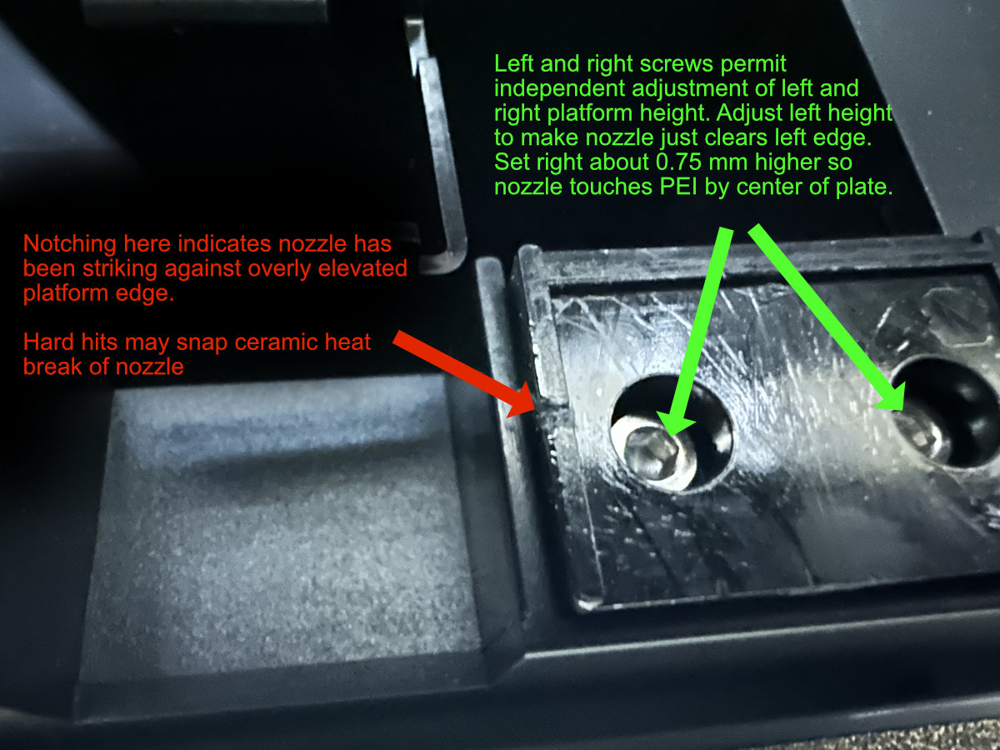
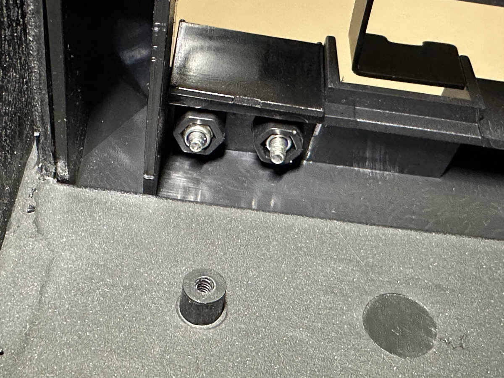

# Prevent Nozzle Collisions Against PEI Nozzle Cooling Platform.

The Qidi Plus 4 Printer must clean its nozzle to properly sense nozzle touch during automatic bed leveling. Part of that process is cooling and rubbing nozzle tip against a small PEI plate mounted upon a spring loaded, elevated platform. The elevated platform is just to the right of "poop" ejector. If the platform sits too high, nozzle tip forcefully crashes against left edge of platform. This impact has been witnessed to snap ceramic heat breaks. Three out of four Plus 4 printers here had their PEI platforms factory set high enough to create notching of the platform where the nozzle had been striking. Fortunately, I had suffered a fractured ceramic heat break on only one printer.

We can prevent hard nozzle strikes by adjusting height and slope of the PEI platform. Left and right edges of the PEI platform are independently adjustable via two screws. The two screws are hidden underneath the small PEI plate. Our goal is to make the nozzle tip smoothly get onto the left edge of PEI plate, yet still rub against center of PEI plate.

## Steps to Adjust PEI Platform

1. Turn off printer power so you can manually move the toolhead. 

2. Pry off the PEI cooling plate

This is readily done with a thin pry tool. Plate is only held in place by adhesive. 

3. Adjust Height Screws

You wil see two screws that were hidden under the PEI cooling plate. Left screw sets left height of platform. Right screw sets right height. We want to lower the left edge enough for the nozzle tip to barely clear. Lower by tightening the screw (clockwise). Raise by loosening the screw.

Gently move nozzle tip across the left edge of the platform to feel and see how the tip engages the platform. Adjust left height screw until nozzle tip just barely clears the left platform edge. You should not feel resistance as the nozzle tip enters the elevated platform. Set right height 0.75 mm higher than left to slightly slope the platform. This should let the nozzle touch PEI plate before nozzle reaches center of platform. 

4. Replace PEI Plate and Verify Fit

Once you have screws initially adjusted, put PEI cooling plate back on to verify how nozzle tip interacts with PEI plate and mounting platform. The nozzle tip should cleanly and effortless glide over left edges of mount and PEI plate. As you move the nozzle further right, it should engage the PEI plate about 1/3 width of plate, certainly by center of plate. I suggest using a piece of printing paper between nozzle tip and platform/PEI plate to feel for nozzle tip contact. Verify that your nozzle does not touch left edges but achieves contact when it travels rightward to 1/3 width of PEI plate. Should heights need further adjustment, remove PEI cooling plate and fine tune your heights.

## CAUTIONS

ALWAYS MOVE TOOLHEAD BACK TO CENTER OF BED BEFORE TURNING PRINTER ON

If you leave the toolhead all the way to the rear and right of the PEI platform, the nozzle will forcefully strike right edge of platform as printer attempts XY homing.

DO NOT COMPLETELY LOOSEN OR REMOVE ADJUSTMENT SCREWS

The adjustment screws thread into a pair of nylock nuts below them. Here is the bottom view which is revealed by opening the rear of the printer and removing the "poop" chute. You do not need to see the nuts to adjust platform height. I show them here to warn against loosening the screws fully. That would detach the nut.

## DONE 
Your Plus 4 printer is now be less prone to snapping its ceramic heat break.

