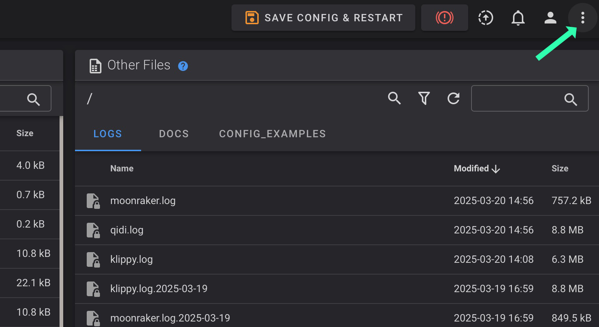
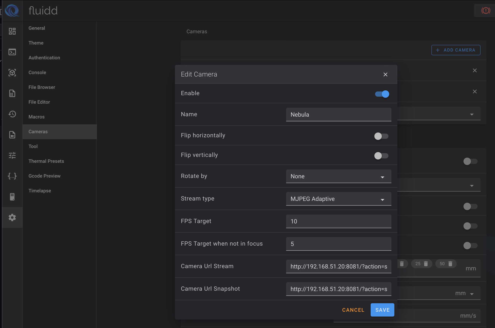

# Adding Extra Cameras to Qidi Plus 4 Printer

Qidi Plus 4 printers ship with a single, built-in camera, but are also capable of displaying multiple USB cameras. This can be accomplished using just the Fluidd GUI. No SSH into printer, nor installation of additional software is needed.


# Pre-requisites: 
```
    b) Have all your USB cameras connected to printer and Fluidd interface showing in a browser. 
    a) Know the IP address of your printer. 
    c) Your printer has a static IP address and never changes its IP address upon startup.
```


# There are three main phases in adding a USB camera

```
    1. Gather required USB device filepath for each connected camera. The filepaths are used to specify which camera is streamed in next phase.

    2. Create a video streamer for each camera. This is done by defining 1st camera in webcam.txt, 2nd camera in webcam2.txt, 3rd camera in webcam3.txt.

    3. Add each video streams as a cameras in Fluidd.

````


# ======= Phase 1 Gathering USB Camera Filepaths =======


Click on the System icon within Fluidd to bring up Fluidd's "system information" page


Click on USB device icon. It is shaped like the USB device symbol. This will bring up the USB devices panel


Once at the USB device panel, select "video" then click on refresh icon to obtain currently connected USB video device info.


You are now looking at info about your USB video devices (cameras). The filepaths for each camera are shown here. This is the information other instructions have users obtain via SSH and command line. As you see, this info is available via Fluidd GUI.


Copy down a unique filepath for each camera. Get the entire filepath starting with "/dev" 
You should obtain one filepath for each camera. It is easiest if you paste your filepaths into a file for use in phase 2, creating the video streams.

If all your cameras are different models (no identical cameras), copy the path_by_id path. Path_by_id does not change if you change which USB port a camera is connected.

If you have more than one camera of the same make/model, they will have identical path_by_ids. In that case, copy the path_by_hardware which will be unnique to each camera, but may change if you alter which port you plug in your cameras.


# ======= Phase 2 Create Video Streamers =======

Create one webcam txt file for each camera. There is already webcam.txt in your fluid configuration files for the stock camera. 

webcam.txt <- 1st camera

webcam2.txt <- 2nd camera

webcam3.txt <- 3rd camera


## --- webcam.txt

You will need to edit two lines in webcam.txt.

line 24 should be uncommented and edited to specify camera filepath
It will become like below. Of course, use YOUR filepath for first camera rather than the one in below example.

24 camera_usb_options="-r 1920x1080 -f 10 -d /dev/v4l/by-id/usb-SYX-231020-J_HD_Camera-video-index0"

line 72 must be uncommented and edited to specify port 8080
72 camera_http_options="-n -p 8080"

Select All and COPY to clipboard. We will be reusing nearly all the same info for next camera streamer.

Save and Close to write out your edits to webcam.txt

## --- webcam2.txt

Have Fluidd create a new webcam2.txt file. It will be empty.
Paste the previously copied webcam.txt contents into webcam2.txt

Again, we need to change two lines.

Line 24 gets the filepath for your next camera. It will be like....

24 camera_usb_options="-r 1920x1080 -f 10 -d /dev/v4l/by-id/usb-UnionImage_Co._Ltd_CCX2F3298_1234567890-video-index0"

Line 72 specifies next port (8081)

72 camera_http_options="-n -p 8081"

Save and Close to write out your edits to webcam2.txt

## --- webcam3.text

Do same for creating webcam3 if you have yet another camera.
In example below, I show use of a path_by_hardware filepath so you know how that would look.

24 camera_usb_options="-r 1920x1080 -f 10 -d /dev/v4l/by-path/platform-ff5c0000.usb-usb-0:1.2:1.0-video-index0"

Line 72 would specify next port (8082)

72 camera_http_options="-n -p 8082"

Save and Close to write out your edits to webcam3.txt

### --- Restart webcamd

Restart webcamd service to enable your newly definied streamers. Services are accessed via the vertical three dots icon in upper right of Fluidd screen



Once there, restart Webcamd.


At this point, camera streams should be acitve, but you will not see them in Fluidd yet. You must also add the cameras to Fluidd's cameras.


# ======= Phase 3 Add Cameras to Fluidd =======
First, compose the URL for each camera stream. This is where you need the printer IP. 

We MUST use the actual IP of the printer because relative URL addresses (like the default camera URL supplied by Qidi) cannot include a port number. We specify port in our URL's to indicate which camera stream we want.

Example camera stream URL's assuming IP of printer is 192.168.1.32

```
   1st camera
      http://192.168.1.32:8080/?action=stream
      http://192.168.1.32:8080/?action=snapshot

   2nd camera
      http://192.168.1.32:8081/?action=stream
      http://192.168.1.32:8081/?action=snapshot

   3rd camera
      http://192.168.1.32:8082/?action=stream
      http://192.168.1.32:8082/?action=snapshot
```

If you point a browser at the STREAM addresses, your browser should already show the specified camera stream. We just have to define the cameras and add them to Fluidd. If they do not appear in your web browser, either you have the wrong URL address or did something wrong setting up the streams. Go back and fix your work until you can see streams in your web browser.

Once you have the stream URL's verified as working, add the cameras to Fluidd.

Go to Fluidd settings and click on cameras to add or edit camera in Fluidd.


Here you can redefine existing cameras or add a camera. FIll in each camera's entries like below using the stream and snapshot URL for each cameera.



Edit existing default camera to use the URL's you composed. 

Be sure to put stream and snapshot URL's in respective entry fields.

If you have removed the Wifi dongle to free up CPU cycles, you can safely set FPS to 10 or sometimes 15. 
If still using WiFi, consider 5 FPS as safer frame rate for CPU load.


After completing camera set up in Fluidd's camera, your cameras should display in main Fluidd page. 
You can select an individual camera or all cameras as your display.


# USB Main Board Ports and What If I Need More Ports?

The two USB 2.0 ports and one USB 3.0 ports all can support cameras.

I have not successfully gotten a camera to work on the USB C port.

If you need more USB ports, you can run three cameras off one USB port via a USB hub. 
I have successfully done so even using just a USB 2.0 port. Did not have to use up the faster USB 3.0 port. 

This USB 3.0 hub worked https://www.amazon.com/dp/B0CD1BHXPZ for three cameras. Got success using path_by_hardware filepaths.


This completes addition of cameras to the Qidi Plus 4 Printer

Guy Kuo


