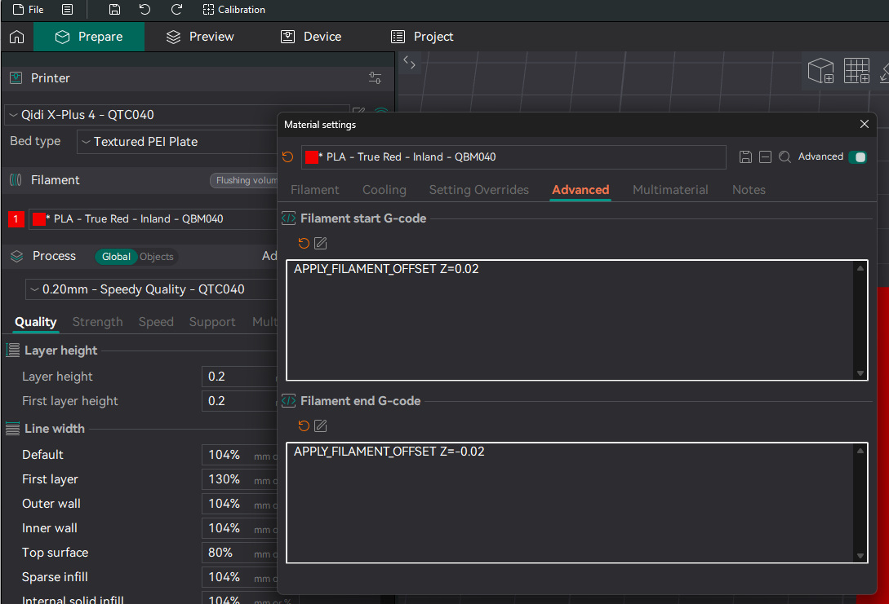

# Cartographer3D for Qidi Plus 4 Installation and Configuration Guide

> [!IMPORTANT]
> Since the 1.7 update the Cartographer integration requires more intervention into Klipper. This guide has been tested on a single printer and should be considered a **Work in Progress**. Whether you have issues or manage to install successfully, we would welcome feedback on the [Official Qidi Discord](https://discord.gg/8WG44NNy) - tag @spooknik and @wazzup77 in the #plus4 channel.

> [!IMPORTANT]
> This guide is not aimed towards novice users. It requires, SSH access, changing Klipper files and updating configs and macros. If you don't understand this, you risk damaging your printer. Performing this mod may limit your ability to update to latest firmware from Qidi. Do not update without checking as it may overwrite important configs.

> [!WARNING]
>  Do not contact Qidi support about issues with bed leveling, first layer issues, klipper, etc after making this mod. It's now your responsibility. ⚠️

This guide covers installing Cartographer3D on your Qidi Plus 4.
It is written for 1.7 firmware version, though by following this guide you should be able to adjust it to earlier versions.

***

# Hardware

You of course need a [Cartographer3D probe](https://cartographer3d.com/). USB version. Flat pack will be the most compatible version, since you can assemble it into any configuration, however this requires soldering. Normal is likely what most mounts will use. 

This guide is not mount specific, only to say you need a mount for the probe. A list of tested mounts are:
- [Beacon3D mount for Qidi Plus4 by stew675](https://www.printables.com/model/1170120-beacon3d-mount-for-qidi-plus4) - recommended
- [QIDI Plus4 beacon/cartographer mount by Vega D](https://www.printables.com/model/1191610-qidi-plus4-beaconcartographer-mount) 
- [Cartographer3D Mount for Qidi Plus 4 by Spooknik](https://www.printables.com/model/1154767-cartographer3d-mount-for-qidi-plus-4)
    - This is not recommended because it is not rigid enough. Also requires soldering wires between the MCU and coil. 
This should be printed with a high-temperature, stable filament - PA or PC reinforced with GF or CF is highly recommended.

You should note the X and Y offset of the center of the coil to the center of the nozzle. That will be needed later.

You must be certain the coil is between 2.6 to 3.0 mm from the nozzle tip.

You need to also pass the USB cable up from the mainboard to the toolhead, the involves taking the back of the printer off and routing the cable accordingly. 

Ideally you want to use one of the USB 2.0 ports, which is either the middle or the bottom port. The top port that has the Wifi dongle is the USB 3.0 and has been known to randomly disconnect with Carto. You can use a USB hub to extend the number of USB ports available.

***

# Software

## 1. Backup Klipper

Firstly, we need to make a backup of your klipper install. Via SSH run the following: 

```
mkdir -p /home/mks/qidi-klipper-backup
(cd /home/mks; tar cvf - klipper printer_data/config) | (cd /home/mks/qidi-klipper-backup; tar xf -)
```

Now your klipper install has been backed up to `/home/mks/qidi-klipper-backup`. Just in case!

## ⚠️ Emergency Restore Procedure ⚠️

If the modding process fails and Klipper no longer starts, follow these steps to restore your system to its previous state.

First, recreate the stock klippy-env using the printer's stock Python version (3.7).

```bash
sudo service klipper stop

sudo rm -rf klippy-env

python3 -m venv /home/mks/klippy-env

source ~/klippy-env/bin/activate

/home/mks/klippy-env/bin/python -m pip install -r /home/mks/klipper/scripts/klippy-requirements.txt

deactivate
```

Then restore `klipper` and `printer_data/config` from your backup

```bash
sudo rsync -a --delete --force /home/mks/qidi-klipper-backup/klipper/ /home/mks/klipper/ && sudo rsync -a --delete --force /home/mks/qidi-klipper-backup/printer_data/config/ /home/mks/printer_data/config/
```

## 2. Updating Python

Cartographer needs a plugin for Klipper to work, this plugin is only supported on Python 3.9 or higher. The Qidi Plus 4 ships with Python 3.7 by default, we need to download Python 3.12 and remake the Klipper virtual environment. 

First download and extract precompiled Python 3.12.3

```bash
sudo service klipper stop

cd ~

wget https://github.com/stew675/ShakeTune_For_Qidi/releases/download/v1.0.0/python-3-12-3.tgz

tar xvzf python-3-12-3.tgz

rm python-3-12-3.tgz
```
Now Python 3.12.3 is in the home directory. We will delete the Klipper virtual environment and recreate it. Don't worry this will not touch any of your user data, but **you will need to reinstall any klipper plugins after this.**

```bash
sudo rm -rf klippy-env

~/python-3.12.3/bin/python3.12 -m venv klippy-env

cd ~/klippy-env

sed -i 's/greenlet==2.0.2/greenlet==3.0.3/' ../klipper/scripts/klippy-requirements.txt # Need to upgrade this package for 3.12.

source ~/klippy-env/bin/activate

bin/pip install -r ../klipper/scripts/klippy-requirements.txt

deactivate
```

## 3. Installing Cartographer for Klipper

Now Klipper installed again using Python 3.12. Now we can install Cartographer.

```bash
cd ~

git clone https://github.com/Cartographer3D/cartographer-klipper.git

./cartographer-klipper/install.sh
```

The plugin is now installed. 

## 4. Patching Klipper

Qidi's version of Klipper has a modified version of `probe.py` and will not work with Cartographer for Klipper, we need to patch it so it will work.

First, make sure klipper is stopped: 
```bash
sudo service klipper stop
```

Run this command, which will download a patched copy of `probe.py`. 

```bash
wget -O /home/mks/klipper/klippy/extras/probe.py https://raw.githubusercontent.com/qidi-community/Plus4-Wiki/refs/heads/main/content/bed-scanning-probes/Beacon3D/RevH-Normal/probe.py
```

Next, we need to navigate to /klipper/klippy/extras/ and replace a couple of binaries with scripts from Qidi's Github. This is to avoid Python version compatibility issues - as of version 1.7 Qidi started adding compiled modules with the firmware. For now, this is limited to Qidi Box-related files. This locks these files to the Python version for which they were precompiled, causing issues for us, since we need to use a higher version. Fortunately, these modules are also opensourced as .py files on Qidi's Klipper repository on GitHub.
If you are doing this guide on 1.6 or earlier, this step may be skipped.

```bash
cd ~/klipper/klippy/extras/

sudo rm -f aht20_f.so box_detect.so box_extras.so box_rfid.so box_stepper.so

wget https://raw.githubusercontent.com/QIDITECH/klipper/1c4531a5c12c27d96ccd3cf5b3e1c7897c49234a/klippy/extras/aht20_f.py

wget https://raw.githubusercontent.com/QIDITECH/klipper/1c4531a5c12c27d96ccd3cf5b3e1c7897c49234a/klippy/extras/box_detect.py

wget https://raw.githubusercontent.com/QIDITECH/klipper/1c4531a5c12c27d96ccd3cf5b3e1c7897c49234a/klippy/extras/box_extras.py

wget https://raw.githubusercontent.com/QIDITECH/klipper/1c4531a5c12c27d96ccd3cf5b3e1c7897c49234a/klippy/extras/box_rfid.py

wget https://raw.githubusercontent.com/QIDITECH/klipper/1c4531a5c12c27d96ccd3cf5b3e1c7897c49234a/klippy/extras/box_stepper.py
```
After doing this, run `ls` command. The listed files should not contain any .so files - if that is not the case (e.g. a future update added a file not listed above) you need to remove it and download the .py from Qidi's Klipper repo.

Once this is done, start klipper: 
```bash
sudo service klipper start
```
Or power cycle the printer.

> [!TIP]
> Now is a good time to reinstall any Klipper Plugins you were using. If you wish to install Shake&Tune again, use the mainline version since Python is now at a newer version.

## 5. Klipper Configs

When you restarted Klipper, it probably crashed with errors that something is not found. 


Don't worry, we just need to update some configs. 

## 5.1. Changes in printer.cfg

You can reference my [printer.cfg](./printer.cfg) that contains the changes below. However, I highly recommend against simply replacing your own file with mine.

We need to modify `[Z_stepper]` with the following:

```diff
[stepper_z]
step_pin:U_1:PB1
dir_pin:U_1:PB6
enable_pin:!U_1:PB0
microsteps: 16
rotation_distance: 4
full_steps_per_rotation: 200
endstop_pin:probe:z_virtual_endstop # U_1:PC3 for Z-max
endstop_pin_reverse:tmc2209_stepper_z:virtual_endstop
- position_endstop:1
position_endstop_reverse:285
position_max:285
position_min: -4
homing_speed: 10
homing_speed_reverse: 10
second_homing_speed: 5
+ homing_retract_dist: 0
homing_positive_dir:false
homing_positive_dir_reverse:true
#step_pulse_duration:0.0000001
```

Comment out (or delete) all the lines in the following sections, these will be added back later:

``` diff
-[z_tilt]
-z_positions:
-    -17.5,138.5
-    335.7,138.5
-
-points:
-    0,138.5
-
-speed: 150
-horizontal_move_z: 5
-retries: 2
-retry_tolerance: 0.05

-[smart_effector]
-pin:U_1:PC1
-recovery_time:0
-x_offset: 25
-y_offset: 1.3
-z_offset: 0.000001
-speed:5
-lift_speed:5
-probe_accel:50
-samples: 2
-samples_result: submaxmin
-sample_retract_dist: 5
-samples_tolerance: 0.05
-samples_tolerance_retries:5

-[qdprobe]
-pin:!PA10
-z_offset:0.000001

-[bed_mesh]
-speed:150
-horizontal_move_z:5
-mesh_min:25,10
-mesh_max:295,295
-probe_count:9,9
-algorithm:bicubic
-bicubic_tension:0.4
-mesh_pps: 2,2
```

## 5.2. Changes in gcode_macro.cfg

We need to change what the printer does at the start of the print to not use the stock Qidi probes and use Carto instead.

You can reference my [gcode_macro.cfg](./gcode_macro.cfg) that contains the changes below. However, I highly recommend against simply replacing your own file with mine.
If you want to apply the changes yourself (e.g. to keep your current gcode_macro.cfg mods), follow the steps below.

Find and replace `[gcode_macro PRINT_START]` with this:

```diff
[gcode_macro PRINT_START]
gcode:
    AUTOTUNE_SHAPERS
    TOOL_CHANGE_END
    DISABLE_ALL_SENSOR
    CLEAR_PAUSE

    
    
    
    
-    set_zoffset
+    SET_GCODE_OFFSET Z=0 # Zero out z-offset 
    M104 S0

    M106 P2 S0
    M106 P3 S0
    M106 S255
    
        G0 X50 Y50 F6000
    
    G28      
-    M141 S0
+    M141 S{chambertemp} # if you want to wait for the chamber to heat, change this to M191
    M140 S{bedtemp}    
    M106 S0
     
        SAVE_VARIABLE VARIABLE=load_retry_num VALUE=0
        SAVE_VARIABLE VARIABLE=retry_step VALUE=None
        SAVE_VARIABLE VARIABLE=is_tool_change VALUE=0
        
            SAVE_VARIABLE VARIABLE=runout_{i} VALUE=0
            G4 P100
        
        
            
            
            
                
                    CUT_FILAMENT
                    MOVE_TO_TRASH
                    M109 S{hotendtemp}
                    EXTRUDER_UNLOAD SLOT={last_load_slot}
                    M83
                    G1 E18 F300
                    T{extruder}
                    G1 E1 F50
                    G1 E28.13 F611
                    G1 E0.97 F50
                    G1 E8.73 F611
                    G1 E0.97 F50
                    G1 E8.73 F611
                    G1 E0.97 F50
                    G1 E-2 F1800
                    
                        M106 S255
                        M400
                        G91
                        G1 X-3 F60
                        G1 X3 F60
                        G90
                        CLEAR_FLUSH
                        M106 S60
                        G1 E34.8 F611
                        G1 E1.2 F50
                        G1 E10.8 F611
                        G1 E1.2 F50
                        G1 E10.8 F611
                        G1 E1.2 F50
                        G1 E-2 F1800
                    
                
                    MOVE_TO_TRASH
                    M109 S{hotendtemp}
                    T{extruder}
                    M83
                    G1 E1 F50
                    G1 E28.13 F611
                    G1 E0.97 F50
                    G1 E8.73 F611
                    G1 E0.97 F50
                    G1 E8.73 F611
                    G1 E0.97 F50
                    G1 E-2 F1800
                    
                        M106 S255
                        M400
                        G91
                        G1 X-3 F60
                        G1 X3 F60
                        G90
                        CLEAR_FLUSH
                        M106 S60
                        G1 E34.8 F611
                        G1 E1.2 F50
                        G1 E10.8 F611
                        G1 E1.2 F50
                        G1 E10.8 F611
                        G1 E1.2 F50
                        G1 E-2 F1800
                    
                
            
                
                    MOVE_TO_TRASH
                    M109 S{hotendtemp}
                    M400
                    EXTRUDER_UNLOAD SLOT={last_load_slot}
                    T{extruder}
                    M83
                    G1 E1 F50
                    G1 E28.13 F611
                    G1 E0.97 F50
                    G1 E8.73 F611
                    G1 E0.97 F50
                    G1 E8.73 F611
                    G1 E0.97 F50
                    G1 E-2 F1800
                    
                        M106 S255
                        M400
                        G91
                        G1 X-3 F60
                        G1 X3 F60
                        G90
                        CLEAR_FLUSH
                        M106 S60
                        G1 E34.8 F611
                        G1 E1.2 F50
                        G1 E10.8 F611
                        G1 E1.2 F50
                        G1 E10.8 F611
                        G1 E1.2 F50
                        G1 E-2 F1800
                    
                
                    MOVE_TO_TRASH
                    M109 S{hotendtemp}
                    T{extruder}
                    M83
                    G1 E1 F50
                    G1 E28.13 F611
                    G1 E0.97 F50
                    G1 E8.73 F611
                    G1 E0.97 F50
                    G1 E8.73 F611
                    G1 E0.97 F50
                    G1 E-2 F1800
                    
                        M106 S255
                        M400
                        G91
                        G1 X-3 F60
                        G1 X3 F60
                        G90
                        CLEAR_FLUSH
                        M106 S60
                        G1 E34.8 F611
                        G1 E1.2 F50
                        G1 E10.8 F611
                        G1 E1.2 F50
                        G1 E10.8 F611
                        G1 E1.2 F50
                        G1 E-2 F1800
                    
                
            
        
    
    M106 S0
    CLEAR_NOZZLE HOTEND={hotendtemp}
    M190 S{bedtemp}     
    M141 S{chambertemp}    
    M104 S140
    Z_TILT_ADJUST
    G29
    G0 Z50 F600
    G0 X5 Y5  F6000
    
    
        M106 P3 S255
    
    M109 S{hotendtemp}
-#  M141 S{chambertemp}  
+    M141 S{chambertemp} # if you want to wait for the chamber to heat, change this to M191    
    M204 S10000
    SET_PRINT_STATS_INFO CURRENT_LAYER=1
    ENABLE_ALL_SENSOR
    save_last_file
```

In the next step, we change the homing macro to make sure Cartographer is not damaged during homing. We also add provisions for power loss recovery and remove sections related to the stock Qidi probe.
Find and modify `[homing_override]` according to this:

```diff
[homing_override]
axes:xyz
gcode: 
    
    
    
    

    m204 S10000
    M220 S100
    
+        SET_KINEMATIC_POSITION Z={printer.gcode_move.position.z} # Set Z position
+        G91
+        G1 Z4 F600 # Lower Z by 4 to prevent dragging the nozzle
        SET_TMC_CURRENT STEPPER=stepper_x CURRENT={HOME_CUR * 0.7} 
        G28 X
        SET_TMC_CURRENT STEPPER=stepper_x CURRENT={HOME_CUR}     
        BEEP I=1 DUR=100       
        G1 X10 F1200
    

    
+         # To avoid double lowering if G28 X Y is called
+            SET_KINEMATIC_POSITION Z={printer.gcode_move.position.z}
+            G91
+            G1 Z4 F600 # Lower Z by 4 to prevent dragging the nozzle
+        
        SET_TMC_CURRENT STEPPER=stepper_y CURRENT={HOME_CUR * 0.9} 
        G28 Y
        SET_TMC_CURRENT STEPPER=stepper_y CURRENT={HOME_CUR}  
        BEEP I=1 DUR=100          
        G1 Y10 F1200
    

    
-        G28 x
-        G28 Y
-        G28 X
+        
+            SET_KINEMATIC_POSITION X={printer.gcode_move.position.x}
+            SET_KINEMATIC_POSITION Y={printer.gcode_move.position.y}
+            SET_KINEMATIC_POSITION Z={printer.toolhead.axis_maximum.z-30}
+            G91
+            G1 Z7 F600	
+            G1 X5 F2400
+            G1 Y5 F2400
+            G4 P2000
+        
+            SET_TMC_CURRENT STEPPER=stepper_x CURRENT={HOME_CUR * 0.8} 
+            G28 X
+            SET_TMC_CURRENT STEPPER=stepper_x CURRENT={HOME_CUR} 
+            BEEP I=1 DUR=100  
+            G1 X45 F1200
+        
+            SET_TMC_CURRENT STEPPER=stepper_y CURRENT={HOME_CUR * 0.9} 
+            G28 Y
+            SET_TMC_CURRENT STEPPER=stepper_y CURRENT={HOME_CUR} 
+            BEEP I=1 DUR=100        
+            G1 Y10 F1200
+
+            SET_TMC_CURRENT STEPPER=stepper_x CURRENT={HOME_CUR * 0.8} 
+            G28 X
+            SET_TMC_CURRENT STEPPER=stepper_x CURRENT={HOME_CUR} 
+            BEEP I=1 DUR=100  
+            G1 X10 F1200
+        

        G1 X150 Y150 F7800

        SET_KINEMATIC_POSITION Z={printer.toolhead.axis_maximum.z-30}
-        QIDI_PROBE_PIN_2
-        probe samples=2
-        SET_KINEMATIC_POSITION Z=1.9
-        G1 Z10 F600
-        Z_VIBRATE
-        QIDI_PROBE_PIN_1
-        probe probe_speed=10
+        probe
        SET_KINEMATIC_POSITION Z=-0.1
        G1 Z30 F480
    

    
    
    
        SET_KINEMATIC_POSITION X=0
        SET_KINEMATIC_POSITION Y=0
        SET_KINEMATIC_POSITION Z={printer.toolhead.axis_maximum.z-30}
        G91
        G1 Z7 F600  
        G1 X5 F2400
        G1 Y5 F2400
        G4 P2000
    
       SET_TMC_CURRENT STEPPER=stepper_x CURRENT={HOME_CUR * 0.8} 
        G28 X
        SET_TMC_CURRENT STEPPER=stepper_x CURRENT={HOME_CUR} 
        BEEP I=1 DUR=100  
        G1 X45 F1200
    
        SET_TMC_CURRENT STEPPER=stepper_y CURRENT={HOME_CUR * 0.9} 
        G28 Y
        SET_TMC_CURRENT STEPPER=stepper_y CURRENT={HOME_CUR} 
        BEEP I=1 DUR=100        
        G1 Y10 F1200

        SET_TMC_CURRENT STEPPER=stepper_x CURRENT={HOME_CUR * 0.8} 
        G28 X
        SET_TMC_CURRENT STEPPER=stepper_x CURRENT={HOME_CUR} 
        BEEP I=1 DUR=100  
        G1 X10 F1200

        SET_KINEMATIC_POSITION Z={printer.toolhead.axis_maximum.z-10}

        G90
        G1 X150 Y150 F7800
        G91
-        QIDI_PROBE_PIN_2
        G28 Z
        G1 Z30  F600
    
    
    
    SET_TMC_CURRENT STEPPER=stepper_x CURRENT={RUN_CUR} 
    SET_TMC_CURRENT STEPPER=stepper_y CURRENT={RUN_CUR} 
    M204 S10000
    G90
-    QIDI_PROBE_PIN_2

```

Find and replace `[gcode_macro G29]` with this:

```
[gcode_macro G29]
variable_k:1
gcode:
    M141 S0
    RESPOND TYPE=command MSG='Heating nozzle to 150 for accurate Z offset'
    M109 S150 # Set nozzle to 150 so any remaining filament stuck to nozzle is softened
    BED_MESH_CLEAR
    SET_GCODE_OFFSET Z=0

    
        G28
    
        G28 Z
    

    RESPOND TYPE=command MSG='Recalibrating Cartographer probe'
    CARTOGRAPHER_CALIBRATE SPEED=2          # Re-Calibrate incase build plate changes
    
    RESPOND TYPE=command MSG='Leveling Z screws'
    Z_TILT_ADJUST
    G28 Z

    
        RESPOND TYPE=command MSG='Creating KAMP bed mesh'
        STATUS_MESHING
        BED_MESH_CALIBRATE RUNS=2 PROFILE=kamp
        BED_MESH_PROFILE LOAD=kamp
        SAVE_VARIABLE VARIABLE=profile_name VALUE='"kamp"'
        
    
        RESPOND TYPE=command MSG='Creating bed mesh'
        STATUS_MESHING
        BED_MESH_CALIBRATE RUNS=2 PROFILE=default
        BED_MESH_PROFILE LOAD=default
        SAVE_VARIABLE VARIABLE=profile_name VALUE='"default"'

    
    CARTOGRAPHER_TOUCH SPEED=2 FUZZY=10 
```


Finally, remove the following lines to prevent the old Z_offset variable from getting saved.

```diff
PRINT_END
[gcode_macro PRINT_END]
gcode:
-    
-       SAVE_VARIABLE VARIABLE=z_offset VALUE={printer.gcode_move.homing_origin.z}
-    
```

```diff
[gcode_macro CANCEL_PRINT]
- save_zoffset
```

## 5.3. Changes in saved_variables.cfg 

Inside `saved_variables.cfg` we need to set `z_offset = 0.0` as this is now handled by Cartographer.

## 5.4. Install carto.cfg

Create a new file in your config folder called `carto.cfg`. Copy and paste the contents of [this](./carto.cfg) into the new file. Save and close. 

Open `printer.cfg` and at the top under the last include, write `[include carto.cfg]`. Save and restart.

This file is where we are storing all the changes to printer.cfg that Carto needs to work. You need to modify a few values in this file to get your carto to work for your setup.

#### [mcu scanner]

#### USB Serial

`serial: /dev/serial/by-id/[your carto here]`

Find this by running `ls /dev/serial/by-id/*` in SSH. It should output something like: `/dev/serial/by-id/usb-Cartographer_614e_XXXXXXXXXXXXXXXXXXXXXXXXXXX`

#### X Y Offset

These should be provided from the maker of the mount you are using. The distance in X and Y from the center of the coil to the center of the nozzle.

`x_offset: 0 # Based on Stew's mount, adjust accordingly` 

`y_offset: -18.8 # Based on Stew's mount, adjust accordingly`

#### [z_tilt]

Depending on your mount's X and Y offset to the nozzle, you need to update the z tilt points so it measures over the lead screws. Generally you will need to apply your probe mount's Z offset to the stock Z tilt points. You can also manually move the toolhead in Fluidd and note down the X and Y coordinates. See the [Klipper docs](https://www.klipper3d.org/Config_Reference.html?h=z_tilt#z_tilt) for more info.

The values below are correct if you are using Stew's mount and just an example.

```
points:
    50, 171.3   # Based on Stew's mount, adjust accordingly
    255, 171.3  # Based on Stew's mount, adjust accordingly
```

#### [bed_mesh]

Similar to z_tilt you need adjust the mesh_min and mesh_max to match your probe's offset. You need to apply your probe mount's X and Y offset to the mesh range so the probe is always scanning over the bed 

[This video](https://www.youtube.com/watch?v=5vmjBXvY6BA) gives a good intro to this concept. 

The values below are correct if you are using Stew's mount.

```
mesh_min: 22,22   # Based on Stew's mount, adjust accordingly
mesh_max: 283,283 # Based on Stew's mount, adjust accordingly
```

That was a lot of configs! But you made it through 🎊

***

## 6. (optional) Enabling filement-based Z offset 

This is yoinked from the Beacon guide by Stew675. Kudos!

If you want to use this feature, add this to your gcode_macros.cfg file.

```bash
[gcode_macro APPLY_FILAMENT_OFFSET]
description: Apply a Z offset adjustment for a specific filament
gcode:
    
    { action_respond_info("Setting Filament Offset to %.3fmm" % (filament_z)) }
    SET_GCODE_OFFSET Z_ADJUST={filament_z}
```

The idea behind APPLY_FILAMENT_OFFSET is to do away with the fiddling about with the global Z offset when changing to filaments that prefer a different Z offset to the replaced filament. By and large the automated filament nozzle temperature management system should set the correct offset for almost all filaments, however there may still be a handful of standout filaments that need tweaking.

With the original method, if the first layer wasn't going down properly, we would have to adjust the global Z offset, and save it, and then that could cause issues later when changing filaments.

APPLY_FILAMENT_OFFSET is designed to be used within the filament material settings within your slicer.

By default, the filament offset is set to 0 whenever a new print starts. If the first layer offset needs to be adjusted, then that can be done the usual way on the printer's screen UI by adjusting the Z offset up/down as required. This is best done with a 1 layer sheet of 100x100mm, and using the screen to apply Z offset adjustments until the first layer sheet is printing well.

When you are happy with the Z offset adjustment, take note of the offset that is displayed, and we can apply that to our filament settings.

For example, let's say that we were printing our test sheet and saw best results with an offset of 0.02mm

We edit the filament start G-code and end G-codes like so:



and save the filament settings. Note that we are reversing the sign of the filament offset in the Filament end G-code section. This allows for filaments with different preferred offsets to be swapped mid-print. This should be especially useful when the QidiBox is released.

The next time that we print with this filament, the filament specific Z offset will be applied and we should get perfect first layers with it moving forwards.

## Finishing up

Now you should have everything set up and you are now ready to follow Cartographer's guide for [calibration](https://docs.cartographer3d.com/cartographer-probe/installation-and-setup/installation/calibration) and [first print](https://docs.cartographer3d.com/cartographer-probe/installation-and-setup/installation/first-print).
You will want to use the Touch mode to allow you for automatic Z offset - keep that in mind when following the Cartographer instructions.

# FAQ

Q. When I run `CARTOGRAPHER_CALIBRATE METHOD=manual` I get: 


A. Your bed is lower and it goes beyond the max movement range Klipper will allow for the Z axis. Simply use `SET_KINEMATIC_POSITION Z=250` and then run `CARTOGRAPHER_CALIBRATE METHOD=manual`

Q. I follwed the guide but I get this error in Klipper 


A. Likely a Klipper plugin needs to be reinstalled. Either disable or reinstall it. If you are reinstalling from Shake&Tune, use this [version](https://github.com/qidi-community/klippain_v511_for_qidi_plus4). Remember to delete the old install. 


## Optional QoL Bed Tramming Macros

This is courtesy of the Beacon guide and stew675. It has just been adapted for Cartographer.

With the Cartographer Probe now providing for accurate bed offset measurements, the probe can be used to make the
task tramming the bed using the 4 knobs under the print bed a lot easier.

Add the following macros to the end of your `gcode_macro.cfg` file:

```
[gcode_macro SCREW_ADJUST_START]
gcode:
    M84
    BED_MESH_CLEAR
    SET_GCODE_OFFSET Z=0
    G28
    Z_TILT_ADJUST
    G28

[gcode_macro SFL]
description: Get zoffset at front-left bed adjustment screw position
gcode:
    
    
    
    
    G1 Z3 F600      # Ensure the bed is moved away from the nozzle
    G1 X{screw_pos_x - carto_off_x + 20} Y{screw_pos_y - carto_off_y + 20} F6000
    PROBE
    G1 Z3 F600      # Ensure the bed is moved away from the nozzle

[gcode_macro SFR]
description: Get zoffset at front-right bed adjustment screw position
gcode:
    
    
    
    
    G1 Z3 F600      # Ensure the bed is moved away from the nozzle
    G1 X{screw_pos_x - carto_off_x - 20} Y{screw_pos_y - carto_off_y + 20} F6000
    PROBE
    G1 Z3 F600      # Ensure the bed is moved away from the nozzle

[gcode_macro SBR]
description: Get zoffset at back-right bed adjustment screw position
gcode:
    
    
    
    
    G1 Z3 F600      # Ensure the bed is moved away from the nozzle
    G1 X{screw_pos_x - carto_off_x - 20} Y{screw_pos_y - carto_off_y - 20} F6000
    PROBE
    G1 Z3 F600      # Ensure the bed is moved away from the nozzle

[gcode_macro SBL]
description: Get zoffset at back-left bed adjustment screw position
gcode:
    
    
    
    
    G1 Z3 F600      # Ensure the bed is moved away from the nozzle
    G1 X{screw_pos_x - carto_off_x + 20} Y{screw_pos_y - carto_off_y - 20} F6000
    PROBE
    G1 Z3 F600      # Ensure the bed is moved away from the nozzle
```

Each of the macros above will position the probe above the knobs so you can adjust and re-measure quickly

To use these macros, first clear the bed mash, home and recalibrate the probe by calling the following macros

```
M84
BED_MESH_CLEAR
SET_GCODE_OFFSET Z=0
G28
Z_TILT_ADJUST
G28
```

then call the macros listed above and look at the last line (eg. `// Result is z=1.948191
`).  This informs you of how far away
the print bed is from the probe.  You can adjust the knob under the bed and call the same macro again to obtain
the new offset.  This can be repeated for each of the 4 screw points until all are equal within ~0.02mm.  It will
be difficult to obtain better accuracy than that.  By default, the Carto probe sets itself to 2.00mm from the center
of the print bed after the call to `G28` is made, so therefore we are aiming for all 4 screw positions to report
something greater than `z=1.98` and less than `z=2.02`

In addition to these, the [SCREWS_TILT_ADJUST](https://github.com/qidi-community/Plus4-Wiki/tree/main/content/Screws-Tilt-Adjust) macro is highly recommended.