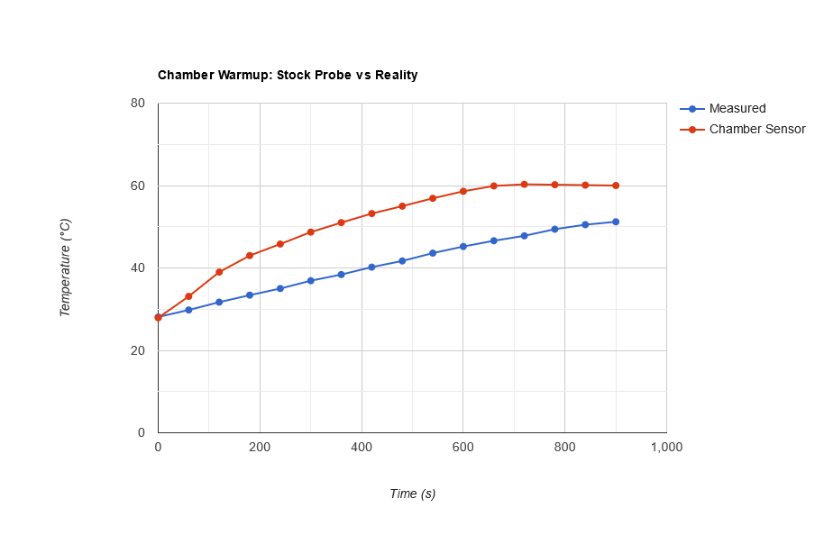

# Chamber Temperature Investigation


## Before we get started

_**Even if you read nothing else in this page, go to this page and make the config recommendations that it recommends.**_

https://github.com/qidi-community/Plus4-Wiki/blob/main/content/chamber-heater-issue/README.md#additional-safety-configurations
___


## What If I told you...


Yep, you read it right.  The chamber temperatures that the stock Qidi Plus4, with its chamber sensor located where it is, are lying to you,
or are at the very least, not an accurate representation of the true chamber air temperature.

Read on, and let's see how deep this rabbit hole goes!

## So where is that little sucker anyway?

A lot of people have asked me where is the Plus4's chamber temperature sensor.

I won't keep you in suspense.  That sneaky thing is hiding here!

In the back right corner of the print chamber, below and to the right of the right stepper motor, and under the frame bar.


## Wait!  How do you know it's wrong?

Good question! First let's figure out how to determine the true chamber air temperatures.
The print chamber is fairly large, and air is swirling about everywhere.
The print head moves about, some fans are on, the print bed is emitting a bunch of heat, it's all a bit of a mess really.

The main point of a chamber heater is reduce the cooldown "shock" for hot filament after it leaves the nozzle.  Hot filament
will contract, and if it contracts too quickly then when the next layer is put on top, it won't sit directly on top of the
layer below it, because that layer will have shifted a bit due to contraction.  Keep repeating this and newer layers will
try to pull back the lower layers as the newer layers cool down, and so we get warping, misaligned layers, and all the other
sorts of shenanigans that you can imagine.

So, the role of the chamber heater is to SLOW DOWN this whole cooling and contraction gig, and give time for freshly laid
filament to settle and slowly take the desired shape.  If we think about this for a bit, it should be fairly obvious that
the most important sections to keep warm are the upper sections where fresh filament is being laid down, and the lower layers
can continue to slowly cool down the further away from the action they are.

Now keep in mind, there's a large chunk of hot metal (that's the print bed) under the printed part(s) that always emitting heat.
Your printed part is basically sitting on a stove top, so it's not like the lower sections are exactly getting the chills either.

So, considering all of that, the best way to measure the chamber air, as far as the printed part is concerned, is in the
vicinity of where the printing action happens.

So, I put a thermal probe to measure the chamber air temps where it really matters, and that's right here!


Here the probe is moving about with the print head, sampling the air temperature from all over the print area, and the part
cooling fan will also be generally pulling air in, helping the probe to get a good reading on the true chamber temperature
as a whole.


## Okay, so what are we talking about here?  How much is it off by?

### The Warm Up Phase

First, let's look at the measured chamber air temperatures during the warmup phase.  The following graph shows just
how far off the true chamber air temperatures are when the chamber heater first turned on to warm up the chamber.



Here we can see that the chamber thermal probe, when the heater unit is on, reads WAY above the real chamber temperattures.
The reason for this is that the chamber heater blows warm air along the bottom of the chamber where it hits the right-side
wall, and then travels up the right-wall which is where the chamber thermal probe sits.
The air by this stage hasn't really mixed well enough to get a good reading on the actual chamber temperatures, and so it
reads way higher than it should.

This has the added effect of the PID mechanism kicking in and lowering the power to the heater unit too early before the
chamber is really up to temperature.
The stock `PRINT_START` macros will also start the printing when the chamber sensor reads 2C LESS than the target.
This translates to around the 600s (10 minutes) mark.
This means that the true chamber air temperatures are only at around 45C when the print starts.
Clearly, this is not an ideal situation, and can possibly lead to warping early on during a print.

### What About During Actual Printing?

Next, let's establish our print testing scenario.  The following tests were conducted with the following conditions:

* Target Chamber Temperature is 60°C
* The chamber was allowed to warm for an additional 10 minutes before starting the actual print.
* Target Print Bed Temperature is 100°C
* The glass lid is on, with no additional sealing
* The printer door is shut, with no additional sealing
* The exhuast fan (Qidi calls it the circulation fan) is set to 40% speed
* The room temperature was 21-24°C (70-75°F)
* A window is open in the room with a fan exhausting air to the outside, so fresh air is also coming into the room
* A typical household ceiling fan is operational, spinning at full speed, to circulate the air in the room
* The macro as [described in detail here](../chamber-heater-issue/README.md) was configured
* _**Custom G-Code was added to set the chamber heater target to 10C after the first layer**_

**Wait!  What was that last point again?**  Yes, you read it right.  I disabled the chamber heater immediately after the prints
started because, and remember, we want to see what the real difference is between what the chamber probe reports versus
the actual chamber air temperature.  You may think I'm crazy to do that, but if you look at the upcoming graphs, it will all
make sense.

*It's important to note that when a 10C target is set, that the chamber heater's fan will still run and circulate air
through the chamber, but it won't actively heat the air.  Setting a target of 0C also disables the fan as well, and
this results in less mixing of the air to equalise the chamber temperature.*

Two different printing scenarios were run.

1. A 270mm tall, 30x30mm tower to assess typical chamber temperatures throughout a print run
2. A special purpose [top-heavy model](./top-heavy.png) that takes 3 hours to climb to 270mm Z, and then 3 hours to progress from 270mm to 280mm in Z-height

*NOTE:* The 0-270mm model was printed later in the day after the room had warmed slightly (about 23-24C), hence the slightly
higher reported temperatures at Z=270mm when compared to the 270-280mm model where the room was around 21-22C.

Without further ado, here's the results:


Yep, you saw it right.  When it comes to reporting the chamber temperatures accurately, Qidi's trusty chamber sensor is basically the thermal probe equivalent of this guy!


## An explanation for the 230-270mm Z-height behavior

Some of you may be wondering why the temperatures started to rise a bit between 230-270mm on the first graph.

Let's consider that in this test the chamber heater fan is always running, and as the print bed descends, the gap
between the print bed and the floor of the chamber is closing up.
This forces the air from the chamber heater to be in contact with the underside of the print bed more directly.

Watching the print bed's heater PWM levels during the test run, I was able to observe that the print bed heater
started to power up a little more strongly than at 0-230mm of Z-height.
This appeared to be the print bed heater compensating for the extra work it was having to do due to the now faster
moving chamber heater air flowing under it.
This is turn caused more heat to be added to the chamber, and thus we see the chamber temps tick up a few degrees here.

Past 270mm of Z-height the print bed starts to increasingly block off the chamber heater fan's airflow, and so
less and less air can get under the print bed, and we therefore see the chamber temperatures start to slowly
drop away by a couple of degrees again until we reach a 280mm Z height.


## Well then! How do we fix this mess?

Don't worry, I got you!

So, within the print-head on the Qidi Plus4, there is a STM32F103XE clone being used for the MCU.

This bad boy has a peak power consumption of just 0.2W at full load (usually MUCH less) and what's more it has a thermal probe built in that the Qidi firmware has access to! This means that it adds some of its own heat to the air temp surrounding it, but in reality, it's a pretty small difference. What's better is that Qidi's FluiddUI config plots this as the GD32 temperature, so we can see what it's doing!

So, let's overlay the GD32 temperature atop the above 2 graphs.


Pretty close to the chamber temperature reality huh?  A little bit high due to its own heat, and also being affected by the stepper motor's heat in the print head.

Estimating a little high isn't great, as it means that the chamber temperatures can drop below the target before the heater unit kicks in to warm the chamber up again.
If anything, it would be better to be a little low, rather than a little high.

So what can we do to fix this?  Well, it just so happens that we've got a useful Klipper trick up our sleeves, and we can make use of that janky stock thermal probe to do it!


## Let's practise some Klipper wizardry!

Here's where we put that grossly underestimating stock probe to some good use to achieve something good!

**WARNING:** Hold onto your hats.  The following section is going to dive into Klipper configs and can be tough to get through for the uninitiated, but I promise it'll be worth it!

Klipper has a handy mechanism called [combined temperature sensors](https://www.klipper3d.org/Config_Reference.html?h=combination#combined-temperature-sensor).

This esoteric command allow us to construct a virtual sensor which combines multiple sensors together into a single value, and then pretends to be a real sensor that we can do stuff with!

Within the stock Qidi `printer.cfg` file, we find this definition for the chamber heater:

```
[heater_generic chamber]
heater_pin:U_1:PC8
max_power:0.4
sensor_type:NTC 100K MGB18-104F39050L32
sensor_pin:U_1:PA1
control = pid
pid_Kp=63.418 
pid_Ki=1.342 
pid_Kd=749.125
min_temp:-100
max_temp:70
```

Now, that sensor mentioned there is precisely the problem we've been talking about this whole time.  In order to do something about it, we need to
pull it out to a separate section, like so:

```
[temperature_sensor chamber_probe]
sensor_type:NTC 100K MGB18-104F39050L32
sensor_pin:U_1:PA1
```

...and now we can reference the problematic sensor independently of the `[heater_generic chamber]` definition.

Elsewhere in `printer.cfg` we can find this stock defintion for the `GD32` sensor:

```
[temperature_sensor GD32]
sensor_type: temperature_mcu
sensor_mcu: mcu
```

This is where the `GD32` line and temperatures in the FluiddUI comes from.

With the above in place, we can now do some wizardry.  We see that `chamber_probe` always reads WAY low, but `GD32` (almost) always reads a little high.  Astute readers will know where I'm going with this.

This allows us to construct a virtual sensor that combines the `GD32` value and the `chamber_probe` value, and give an increased preference to the `GD32` temperature, and take the average (also called mean).

We do this like so:

```
sensor_type: temperature_combined
sensor_list: temperature_sensor GD32, temperature_sensor chamber_probe, temperature_sensor GD32, temperature_sensor GD32
combination_method: mean
maximum_deviation: 70
```

This counts the `GD32` sensor 3 times, and the `chamber_probe` sensor once, sums them together, and divides the total by 4, to give a 3:1 weighted average in favor of the `GD32` sensor.

Putting this all together gives us the following NEW configuration for the `[heater_generic chamber]` section:

```
[heater_generic chamber]
heater_pin:U_1:PC8
max_power:0.4
control = pid
pid_Kp=63.418 
pid_Ki=1.342 
pid_Kd=749.125
min_temp:-100
max_temp:80
sensor_type: temperature_combined
sensor_list: temperature_sensor GD32, temperature_sensor chamber_probe, temperature_sensor GD32, temperature_sensor GD32
combination_method: mean
maximum_deviation: 70
```

What's more is that the FluiddUI, AND the screen on the printer, will all report this new virtual sensor temperature as the Chamber Temperature, AND it will be used to control what the chamber heater does!

Let's overlay our new virtual sensor temperature onto the previous graphs:


Aha!  Much better!!

## But it looks to be underestimating a bit now!  Why is that good?

It's still a bit under the true temperatures, but when it comes to estimating the true chamber temperature it's better to underestimate by a degree or two, than to over-estimate.
This gives the chamber heater time to turn on and warm things up again when needed before things get too cold.
Remember, it's heating a fairly large volume, so a little head start is a good thing.

Keep in mind the vast difference to the stock thermal sensor, where it was WAY underestimating, and so always running the heater unit way more than necessary.

Save power, temperatures more stable, less wild swings.  It's all good news now!


## What do full print run chamber temps look like now with all this?

**Please bear with me.  Additional data being gathered using Firmware 1.4.3 at this moment as this has caused me to rerun tests** 

___


(LOTS OF STUFF TO COME)

## Don't bore me with the details, just tell me what to do!
