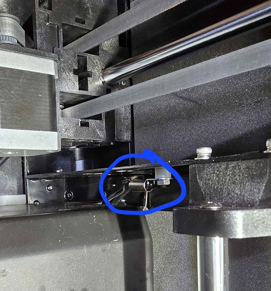
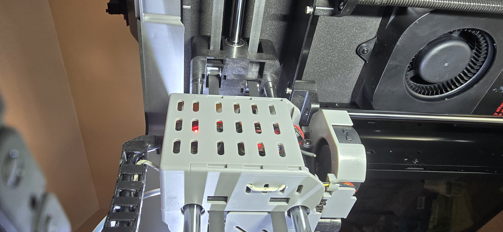

# Chamber Temperature Investigation

(This page is still heavily under construction)

___
## Before we get started

_**Even if you read nothing else in this page, go to this page and make the config recommendations that it recommends.**_

https://github.com/qidi-community/Plus4-Wiki/blob/main/content/chamber-heater-issue/README.md#additional-safety-configurations
___

## What If I told you...

Yep, you read it right.  The chamber temperatures that the stock Qidi Plus4, with its chamber sensor located where it is, are lying to you.

Read on, and let's see how deep this rabbit hole goes!

## So where is that little sucker anyway?

A lot of people have asked me where is the Plus4's chamber temperature sensor.

I won't keep you in suspense.  That sneaky thing is hiding here!

In the back right corner of the print chamber, below and to the right of the right stepper motor, and under the frame bar.

## So, what are we talking about here?  How much is it lying?

Well, first, let's figure out how to determine the truth.  The print chamber is fairly large, and air is swirling about
everywhere.  The print head moves about, some fans are on, the print bed is emitting a bunch of heat, it's all a bit of
a mess really.

The main point of a chamber heater is reduce the cooldown "shock" for hot filament after it leaves the nozzle.  Hot filament
will contract, and if it contracts too quickly then when the next layer is put on top, it won't sit directly on top of the
layer below it, because that layer will have shifted a bit due to contraction.  Keep repeating this and newer layers will
try to pull back the lower layers as the newer layers cool down, and so we get warping, misaligned layers, and all other
sorts of shenanigans that you can imagine.

So, the role of the chamber heater is to SLOW DOWN this whole cooling and contraction gig, and give time for freshly laid
filament to settle and slowly take the desired shape.  If we think about this for a bit, it should be fairly obvious that
the most important sections to keep warm are the upper sections where fresh filament is being laid down, and the lower layers
can slowly cool down further.

With that in mind, it would appear that the best way to measure the chamber air, as far as the printed part "cares" about it,
is in the vicinity of where the printing action happens.

So, I put a thermal probe to measure the chamber air temps where it really matters, and that's right here!

(LOTS OF STUFF TO COME)

## Don't bore me with the details, just tell me what to do!
