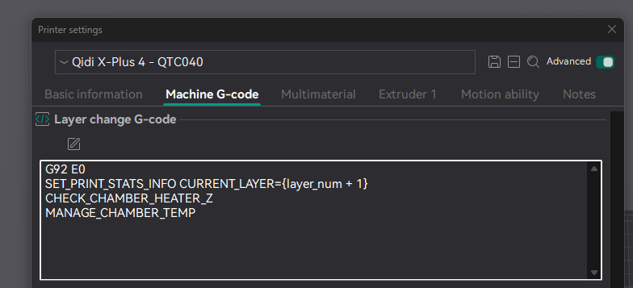

# Chamber Temperature Manager

## Add the following to your `gcode_macro.cfg` file

```
[gcode_macro MANAGE_CHAMBER_TEMP]
gcode:
    
    
    
        M106 P3 S255                    # Too hot! Set the chamber circulation fan to 100%
    
        
        
            M106 P3 S0                    # Disable Chamber Circulation Fan
        
            
            M106 P3 S{speed}
        
    
```

Make sure that this macro gets called on each layer change by adding it to the layer change machine g-code section in the Printer defition in your slicer.

For example:



## What it does

The point of this macro is to keep ramping up the chamber exhaust fan speed if the chamber temperature is above the target chamber temperature.

The further above the target the chamber temperature is, the faster it runs the chamber exhaust fan.  This is an attempt to keep the chamber temperature from overheating

- It turns off the exhaust fan is the chamber is below the target temperature
- If the chamber is above 70C, then it turns on the exhaust fan full blast, to prevent overheating (or try to)
- If the chamber is a little warmer than the target then it slowly ramps the exhaust fan speed

For example:

- If the chamber temperature is More than 5C above the target, then the exhaust fan is set to 100%
- If the chamber temperature is 1C above the target, the exhaust fan is at 20%
