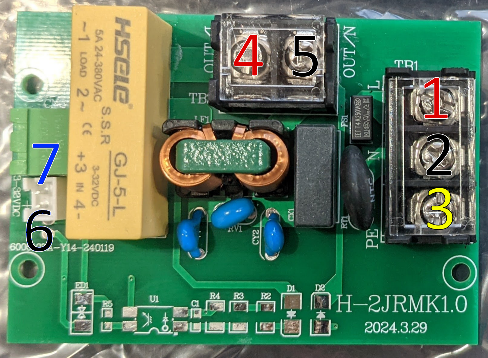
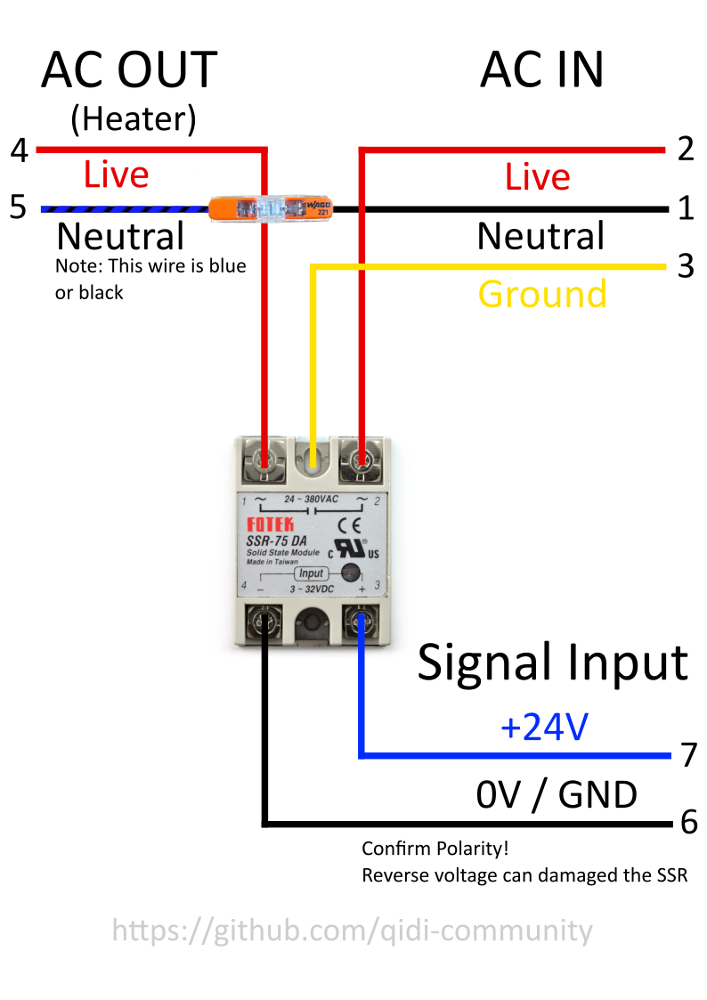

# Qidi Plus 4 SSR Upgrade

The Qidi Plus 4 contains an SSR (solid state relay) board that controls the mains AC power to the chamber heater. On early units of the printer this board was melting. Qidi's solution was to reduce the maximum power in the heater can use in Klipper firmware. The issue is explained in-depth [here.](https://github.com/qidi-community/Plus4-Wiki/tree/main/content/ssr-board)

This is not ideal for a few reasons:

- Software should not be the sole factor preventing a competent from overheating and damaging the printer. 
- The chamber heater now has a reduced amount of effective wattage and heat up times are very slow. [However this has been optimized as much as possible.](https://github.com/qidi-community/Plus4-Wiki/tree/main/content/tuning-for-40-percent-heater-power)
- Initial findings show Qidi's SSR board still gets very hot (120C) even with the reduced power.

Because of these reasons, we have developed a hardware replacement for the SSR board which uses quality off the shelf components.

### Replacement SSR

⚠️ It also requires you to work with AC mains wiring. A mistake in your work can cause harm to you and/or those around you. Please understand and only preform this upgrade if you know what you are doing. We accept no liability for damage or harm to you, others or your property. If you are in doubt, do not perform this upgrade. ⚠️ 

This upgrade replaces Qidi's SSR board with a DIN mounted SSR. We believe only the highest quality SSR modules should be used and recommend the following: 

- OMRON G3NA-210B
- Panasonic AQA211VL 15A
- Fotek SSR-10DA ❗Be careful of clones that look similar. Real Fotek SSRs are made in Taiwan, not China.

They were chosen based on the following:

- Well known and reliable brand
- Ability to handle 10 amps or higher continuously
- Zero-crossing Switching
- Contain a snubber circuit to prevent EMI pollution on the AC line
- (Optional) Contain over temp protection. 

### Install
⚠️This is where the AC mains wiring starts. Do not proceed if you are in doubt of what you are doing. Your safety is your responsibly ⚠️

**This process is WiP!**

- Print [this mount](https://www.printables.com/model/1052218-qidi-plus-4-ssr-board-mount) for the SSR 

- Follow [this video](https://drive.google.com/drive/folders/180hEn-bLIeLqfGz-xd5-HUZBBD4ypZ1-) for opening the printer and accessing the SSR.

- Make note of the wiring on Qidi's SSR board. There are 7 wires.

- Remove Qidi's SSR board and Install the printed mount with the new SSR.

- Connect the wires as follows. You must splice together wire 2 and 5. Double check your work. 

- With the rear panel still removed, power on the printer. 

- Start the chamber heater and check that it is heater and the new SSR installation is performing correctly.

