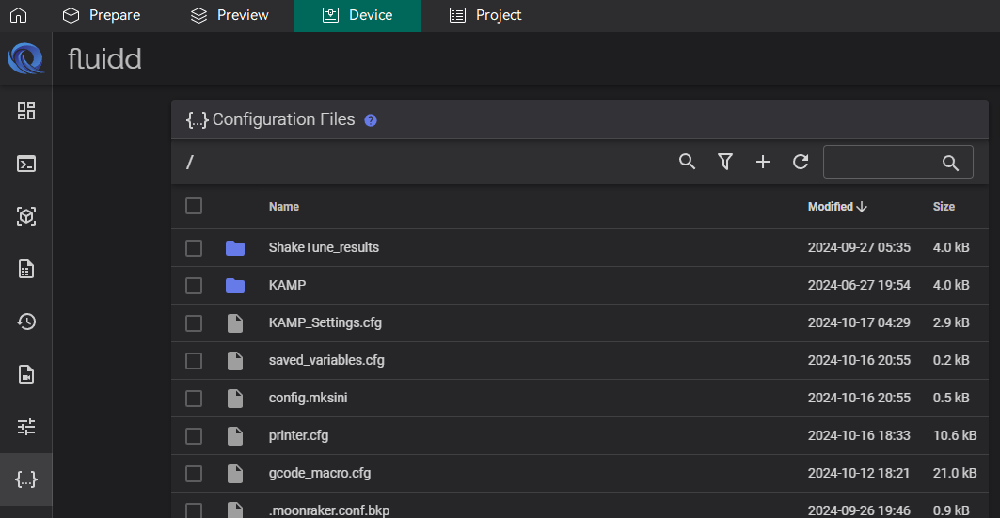
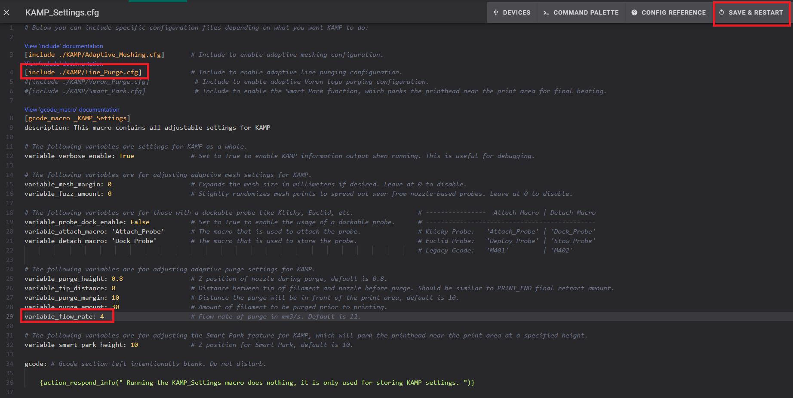
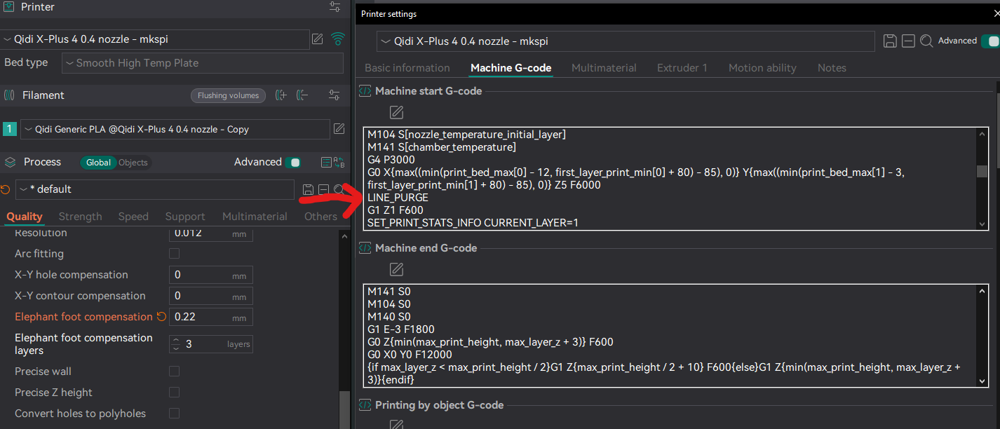

# Enabling KAMP Purging

KAMP Purging draws a single short ~30mm long, ~2mm wide, and ~0.8mm tall line near the front left of the area that the model will occupy.

This serves a similar purpose to the stock Qidi purge patterns by clearing the nozzle of any oozing material just before starting the first print object.

The KAMP Purge line uses about the same amount of filament as the stock Qidi purge pattern.

The main complaint about the stock Qidi purge pattern is that it can be difficult to remove cleanly. This can result in touching the build surface area excessinvely, possibly leaving oily residue from fingers. In turn, _this_ can then affect surface adhesion quality for future prints until the plate is cleaned/washed again.

The KAMP purge line, being thicker and shorter, makes it easy to flick off the build surface with a fingernail, resulting in less contact with the build plate.

## How to Enable

TL;DR Doing the following will enable the `LINE_PURGE` macro in Klipper, which we will use later.

First we must edit the `KAMP_Setting.cfg` file, which lives in the same directory as `printer.cfg`



or go to directory `/home/mks/printer_data/config` if you're using [SSH](https://github.com/qidi-community/Plus4-Wiki/tree/main/content/ssh-access).

Uncomment the line `[include ./KAMP/Line_Purge.cfg]`.

> [!TIP]
> If you plan on printing with TPU, I also recommend changing the `variable_flow_rate` setting to a value of `4`.
The default of `12` here is way too high for TPU, and possibly some other filament types, and can cause oozing and extruder issues.

### Restart the Printer

If you've edited the files through Fluidd, Use the orange "Save & Restart" button up top



If you used SSH, please note that the files you've just edited are not necessarily written to disk yet. 
To force this to happen, run the command `sync`. If that comes back with no further remarks and has an exitcode of `0`, you can powercycle the printer.


## Editing the Printer's Start G-Code in the slicer

The stock Qidi purge pattern is created by a set of lines in the Printer's Start G-Code definition in the slicer.

The Qidi Purge Pattern G-Code will look like this:

```
G0 Z[initial_layer_print_height] F600
G1 E3 F1800
G1 X{(min(print_bed_max[0] - 12, first_layer_print_min[0] + 80))} E{85 * 0.5 * initial_layer_print_height * nozzle_diameter[0]} F3000
G1 Y{max((min(print_bed_max[1] - 3, first_layer_print_min[1] + 80) - 85), 0) + 2} E{2 * 0.5 * initial_layer_print_height * nozzle_diameter[0]} F3000
G1 X{max((min(print_bed_max[0] - 12, first_layer_print_min[0] + 80) - 85), 0)} E{85 * 0.5 * initial_layer_print_height * nozzle_diameter[0]} F3000
G1 Y{max((min(print_bed_max[1] - 3, first_layer_print_min[1] + 80) - 85), 0) + 85} E{83 * 0.5 * initial_layer_print_height * nozzle_diameter[0]} F3000
G1 X{max((min(print_bed_max[0] - 12, first_layer_print_min[0] + 80) - 85), 0) + 2} E{2 * 0.5 * initial_layer_print_height * nozzle_diameter[0]} F3000
G1 Y{max((min(print_bed_max[1] - 3, first_layer_print_min[1] + 80) - 85), 0) + 3} E{82 * 0.5 * initial_layer_print_height * nozzle_diameter[0]} F3000
G1 X{max((min(print_bed_max[0] - 12, first_layer_print_min[0] + 80) - 85), 0) + 3} Z0
G1 X{max((min(print_bed_max[0] - 12, first_layer_print_min[0] + 80) - 85), 0) + 6}
```

> [!TIP]
> If you don't feel comfortable at first to delete the lines, you can "comment them out" by adding a `;` at the start of the line. You can always return to delete them later.
> 

We want to remove those lines and put `LINE_PURGE` in their place, like so.



Restart klipper.
Now you have an easy to remove purge line that takes up less of the build area.

> [!NOTE]
> At the start of a print during KAMP purging you might notice a comment in the console about turning on firmware retraction. Ignore this. It is not necessary and slicer based retraction is superior.
