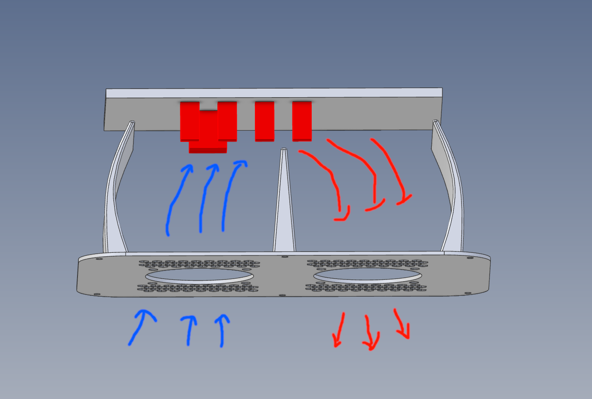

# Mainboard Cooling for QIDI Plus 4

Link to the model: https://www.printables.com/model/1336838-mainboard-cooling-for-qidi-plus-4

## Why Should I Care About Mainboard Cooling?

There are at least two important reasons to improve mainboard cooling in your QIDI Plus 4:

1. **Performance Stability**  
   When the CPU reaches high temperatures, it may reduce its clock frequency to cool down.  
   This can result in issues like the `MCU U_1 shutdown: Timer too close` error when uploading large models, as the CPU can't complete tasks on time.  
   Lower temperatures help maintain full performance and reduce the chances of such errors.  
   Performance tweaks are covered in guide: [Plus4 System Performance Tuning](../system-tuning/README.md), but once these are applied, proper cooling becomes even more critical.

   Similarly, while I didn't prove it, it’s likely that overheated motor drivers reduce current to lower their temperature, which could cause inconsistent motor speeds or torque. Cooling may help avoid this.

2. **Hardware Longevity**  
   Constant operation at high temperatures accelerates component aging, which may lead to malfunctions or hardware failure over time.  
   We’ve seen this issue confirmed in consumer hardware like Intel’s 13th and 14th-gen CPUs.

---

## Airflow Matters Both Ways
Proper cooling isn’t just about pushing fresh air in — it's equally important to remove the hot air from the enclosure.

If you only blow air into the mainboard chamber without an effective way to exhaust it, warm air will accumulate, reducing the efficiency of the cooling system.  
This is why this design uses **a push–pull fan setup**: one fan brings in fresh air, while the other actively pulls hot air out.

This continuous airflow loop helps maintain low temperatures even during long prints or high CPU load.

---

## Temperature Results (Chamber Heating Disabled)

| Component | Before Cooling                         | After Cooling                        | Difference | 
|-----------|----------------------------------------|--------------------------------------|------------|
| GD32      | 58°C                                   | 53°C                                 | -5°C       |
| X Driver  | 90°C                                   | 63°C                                 | -27°C      |
| Y Driver  | 82°C                                   | 58°C                                 | -24°C      |
| Screen    | [Screenshot Before](./img/before.JPEG) | [Screenshot After](./img/after.JPEG) |            |

## Model

## Required Parts

- Printed fan duct (included in STL files)
- 2× 60mm 24V DC fans  
  ⚠️ Max current: 0.05A per fan (the stock fan is 0.1A).  
  The fans are connected in parallel, so the total current should not exceed the stock fan’s.
- 2× 60mm fan grills (not printed or integrated into the duct)  
  Using metal grills improves airflow and reduces noise, especially in confined spaces where printed grills or close mesh could interfere with fan blades.
- 8× screws for fan mounting
- 1× fan connector (2-pin)

### Photos
 * [Parts](./img/parts.JPEG)
 * [Assembled Front](./img/assembled_front.JPEG)
 * [Assembled Back](./img/assembled_back.JPEG)

## Cable Management

Cable management in the stock QIDI Plus 4 is poor.  
I strongly recommend organizing cables to optimize airflow.  
Poorly placed cables can obstruct airflow or block tiny heatsinks.

Since the fan duct is designed to fit closely around the mainboard, poorly managed cables may get pinched or interfere with installation.

[Cable Management](./img/cable_management.JPEG)

## Fan Orientation

It’s important to orient the fans correctly:

- **Left fan (push)** – blows fresh air into the mainboard compartment
- **Right fan (pull)** – exhausts warm air out

When looking from the back of the printer, the mainboard is slightly to the left, so this setup ensures fresh air reaches the hottest parts efficiently.

[Mounted](./img/mounted.JPEG)

## Additional Tips

- I recommend also installing this mod:  
  👉 [Adaptive Main Board Cooling Configuration](../adaptive-main-board-cooling/README.md)  
  This allows fan speed to be adjusted automatically depending on system temperature, reducing noise while keeping your system cool even when idle.
