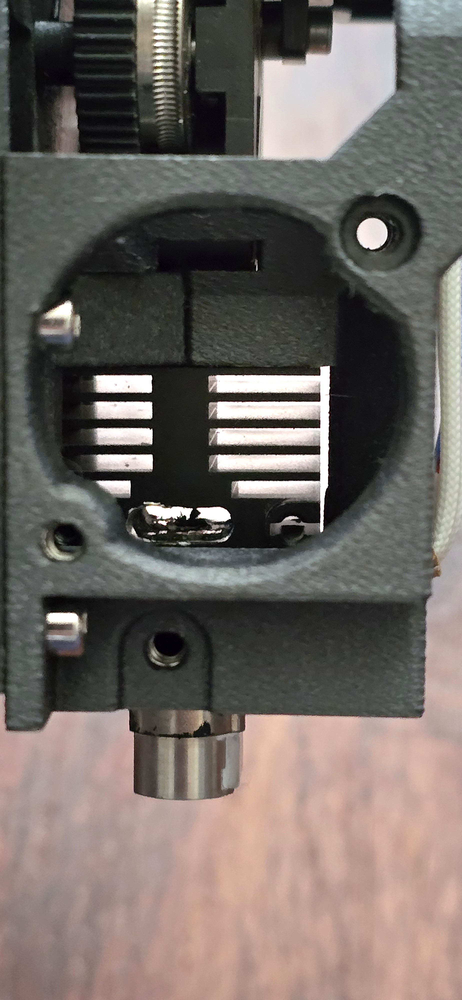

# Qidi Plus 4 Modular Toolhead

This page is intended to display the flexibility and options that the [custom front tool-head carrier plate](https://www.printables.com/model/1221132-custom-front-tool-head-carrier-plate-for-qidi-plus) modular design offers

The custom tool-head plate has a variety of attachments that can be used to construct a number of configurations for customising your Qidi Plus 4.

These include:

- Mounting the stock heatsink fan with a fully ducted path to the hotend heatsink to minimise heat creep
- Providing a stock inductive probe mounting adaptor
- Mounting a Beacon Eddy Current Probe using the classic Beacon mount model
- Mounting a Beacon in a Clear-View orientation which provides much better visibility of the nozzle and print
- Adding a front-mounting 5015 Blower fan for part-cooling which frees up the rear-left exclusion zone
- Front-Blower Mode can use either the Stock Inductive Probe, or be used with a Beacon Eddy Current Probe

