# Qidi Plus 4 Modular Toolhead

This page is intended to display the flexibility and options that the [Custom Front Tool Head Carrier Plate](https://www.printables.com/model/1221132-custom-front-tool-head-carrier-plate-for-qidi-plus) modular design offers

The custom tool-head plate has a variety of attachments that can be used to construct a number of configurations for customising your Qidi Plus 4.

Combined with the [Front 5015 Blower Part Cooling Fan Mod](https://www.printables.com/model/1232611-modular-front-mounted-5015-blower-modification-for),
there is now a wide range of options to suit almost everyone's circumstances.

These include:

- Mounting the stock heatsink fan with a fully ducted path to the hotend heatsink to minimise heat creep
- Providing a stock inductive probe mounting adaptor
- Mounting a Beacon Eddy Current Probe using the classic Beacon mount model
- Mounting a Beacon in a Clear-View orientation which provides much better visibility of the nozzle and print
- Adding a front-mounting 5015 Blower fan for part-cooling which frees up the rear-left exclusion zone
- Front-Blower Mode can use either the Stock Inductive Probe, or be used with a Beacon Eddy Current Probe

**Note:** All images may be clicked on for a larger version of the image

# Assembly Options

---

## Inductive Probe Adaptor

The following shows the simplest option of re-mounting the stock heatsink fan with the ducted fan mount,
and using the inductive probe mount adaptor to re-use the stock inductive probe

### Parts Required

[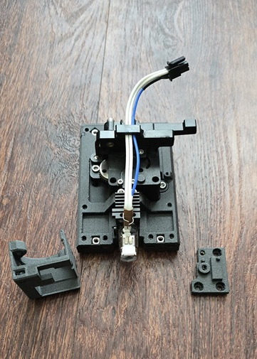](./images/Stock-Fan-Probe-Items.jpg)

### Assembly Photos

[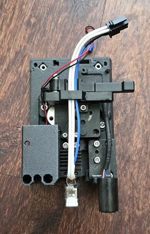](./images/Stock-Fan-Probe-Assembly-1.jpg)
[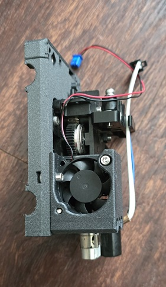](./images/Stock-Fan-Probe-Assembly-2.jpg)
[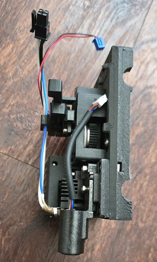](./images/Stock-Fan-Probe-Assembly-3.jpg)

---

## Classic Beacon Mount

These are the items and assembly photos that uses lightly modified version of my original Beacon mount and
remixes it for the modular tool-head

### Parts Required

[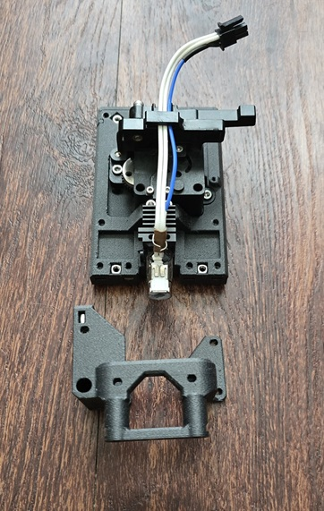](./images/Classic-Beacon-Mount-Items.jpg)

### Assembly Photos

[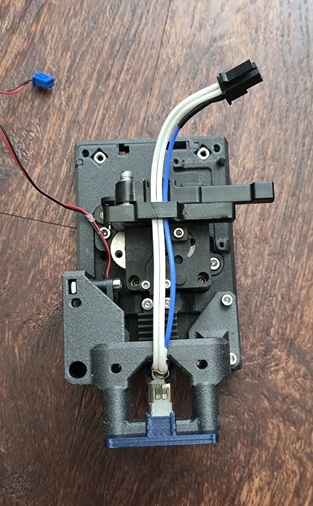](./images/Classic-Beacon-Mount-Assembly-1.jpg)

[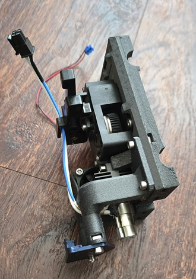](./images/Classic-Beacon-Mount-Assembly-3.jpg)

---

## Clear-View Beacon Mount

This is an option that arises from mixing the Ducted Heatsink Fan Model from the Tool Head Carrier Plate project
with the Beacon mount model from the Front 5015 Blower Fan Project

### Assembly Photos

[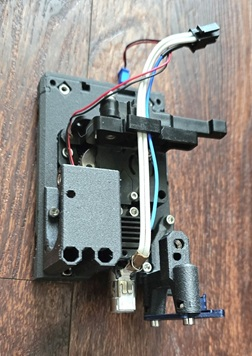](./images/Clear-View-Beacon-Assembly-1.jpg)
[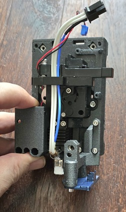](./images/Clear-View-Beacon-Assembly-2.jpg)
[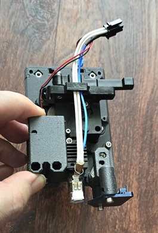](./images/Clear-View-Beacon-Assembly-3.jpg)

---

## Front 5015 Part-Cooling Blower with Beacon Probe

### Parts Required

### Assembly Photos

[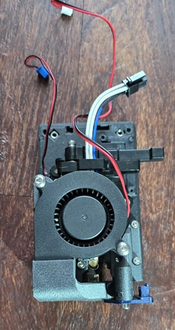](./images/Front-Blower-Beacon-Assembly-1.jpg)
[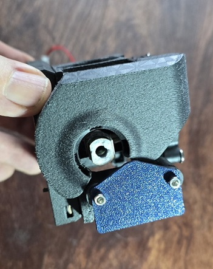](./images/Front-Blower-Beacon-Assembly-2.jpg)
[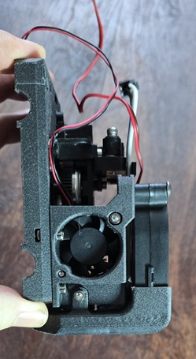](./images/Front-Blower-Beacon-Assembly-3.jpg)
[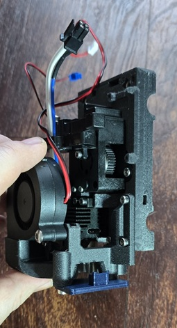](./images/Front-Blower-Beacon-Assembly-4.jpg)

---

## Front 5015 Part-Cooling Blower with Stock Inductive Probe

### Parts Required

[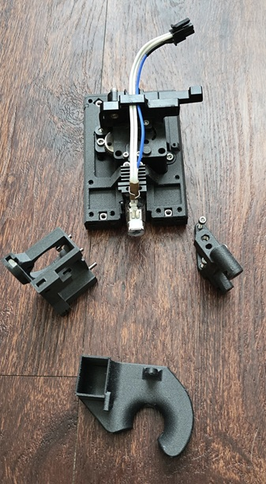](./images/Front-Blower-Stock-Probe-Items.jpg)

### Assembly Photos

[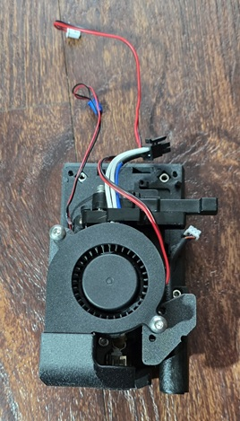](./images/Front-Blower-Stock-Probe-Assembly-1.jpg)
[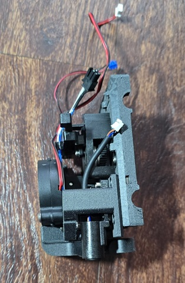](./images/Front-Blower-Stock-Probe-Assembly-2.jpg)

---

## Ducted Heatsink Fan Path

The following image displays the "jigsaw" nature of the fit of the ducted heatsink fan mount to
provide a fairly focused path into just the hotend heatsink.  When tested with PLA with the
original stainless steel heat-break nozzle, this is sufficient to prevent heat creeping.

[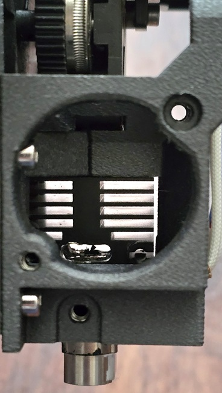](./images/Ducted-Heatsink-Fan-Path.jpg)
