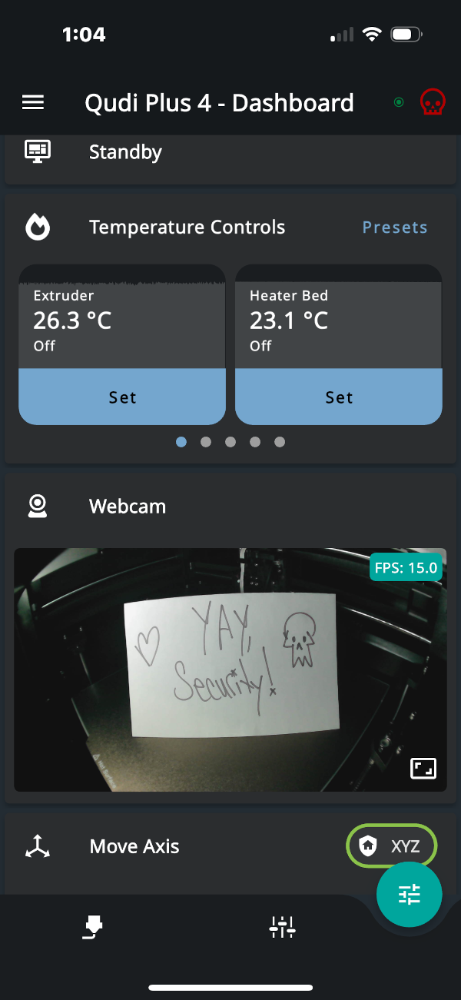

# Secure Remote Access

## Overview
Instead of using Qidi Link to access your printer, this guide serves to help you
set up a VPN mesh network that allows you to access your printer using various Klipper
apps for mobile devices, using your trusted network as opposed to Qidi's.

## Prerequisites
* Comfortable with SSH access to your printer, executing commands, and editing files from CLI
* Have a free Tailscale account - https://login.tailscale.com/start

**NOTICE:**
All of the below steps should be done from a laptop or computer that you use to print from regularly for simplicity. None of these commands need to be executed over your tailscale network. Unless specifically called out, when instructions call you to ssh to your printer, the expectation is that you are connecting over your LAN IP address.

The only step that requires the VPN IP address or [magicdns](https://tailscale.com/kb/1081/magicdns) name is the last step and that is only for the mobile klipper client you installed to be configured.

## 1. Setup Tailscale VPN Account
Follow the onboarding guidelines from Tailscale to create and register your first device, preferably your phone since you are replacing Qidi Link! Instructions are [here](https://tailscale.com/kb/1017/install). Once you see your phone listed in the devices, move on to the next step!

## 2. Optional - Disable qidi link
Since we don't need this service running anymore, let's scavenge back those resources! From the Qidi Plus 4 screen, enable lan-only mode.

## 3. Install Tailscale
 
To install tailscale on your printer, first connect via ssh and run this single command:

```
curl -fsSL https://tailscale.com/install.sh | sh
```

Follow the onscreen instructions to complete the installation process.

Once you complete the installation and receive confirmation of installation, head over to your tailscale.com account to confirm it! Click the admin console link in the top right of the tailscale site and look for your printer in the list of machines. 

**Alternative Option - Subnet Router**

While out of scope for this specific documented procedure, it's worth calling out that one can configure a [subnet router](https://tailscale.com/kb/1019/subnets) to avoid having to install the tailscale client on your printer. It allows for more flexibility but comes at the cost of complexity; ie dedicated device acting as the subnet router and configuring it as a gateway on devices that you want access to. This notice is to draw awareness to the end user that alernative installations exist. 


## 4. Configure Moonraker 
Since you are connecting to the printer from a different IP subnet, we need to configure moonraker to allow this connection. For most people, the easiest way to add this to the moonraker configuration is through the fluidd web interface on your printer. To do that, punch in the IP address of your printer in a browser, press the `x` key to open configurations, select the `moonraker.conf` file. 

In section labeled authorization, we'll add the tailscale subnet `100.64.0.0/24`, as displayed here:

```
[authorization]
force_logins: True
trusted_clients:
    100.64.0.0/10
    10.0.0.0/8
    127.0.0.0/8
    169.254.0.0/16
    172.16.0.0/12
    192.168.0.0/16
    FE80::/10
    ::1/128
```

Click save and restart!

## 5. Accessing On The Go!
Now that your printer is on your VPN and moonraker is configured to allow access for connections from it, let's talk about options for access.

### Connecting to the fluidd interface
This is the easiest option. Just use the [magicDNS](https://tailscale.com/kb/1081/magicdns) name or the IP associated with your printer in your list of Tailscale Machines in your web browser. This should load up the fluidd interface.

### Using a klipper mobile app
Using your device's app store, install a Klipper client. There are multiple options available on Apple devices, with no preferential treatment for any particular one. Try them out and find one you like! The important part is that the app will prompt you for an address for your printer. Enter the IP address or MagicDNS name associated with your printer in this field. That should be all you need to connect your printer!

Pictured below is the UI from the iOS app MobileRaker:



You can test remote access by disabling Wi-Fi on your mobile device and trying either option above using the tailscale IP or magicDNS entry. Congratulations! You are now using a private network to access your device!

## Closing Pointers
While not required, it can be convenient to disable key expiration on the printer. This obviously has security trade-offs, but nothing especially critical, all things considered. Disabling key expiration ensures your printer remains accessible without requiring you to periodically log in to Tailscale from the printer. You can disable key expiration from the Tailscale UI when selecting the printer from your list of hosts.
