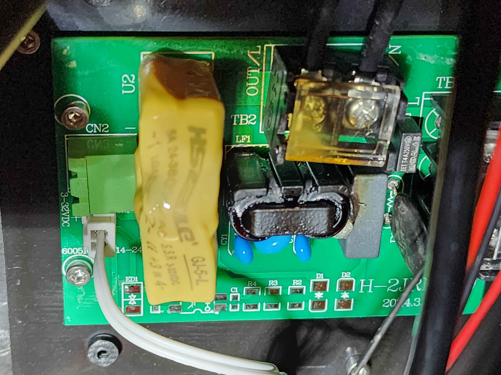

# Qidi Plus 4 SSR Board

The initial units of the Qidi Plus 4 have a problem with the SSR Board that control the chamber heater. It appears under certain conditions the SSR board is not capable of handling the current needed to run the chamber heater on 110 - 120V. 

This results in the SSR board getting very hot and melting the SSR and common mode choke on the board, causing a failure of this component. 

This presents a potential fire hazard and risk of further damage to the printer and surroundings. Because of this, **we advise anyone using the Qidi Plus 4 in North America (or other areas on 110 - 120V  mains)** to take following steps before using the printer:

- Upgrade the firmware to 1.4.3. This puts a power limit on the chamber heater and reduces the risk it will overheat. This is stopgap solution as software should never account for poor hardware design. 

- Request a new SSR board from Qidi. There is an updated SSR board which Qidi is claiming will prevent the problem together with the firmware 1.4.3 (Although unconfirmed at time of writing - 26/10/2024).

If you are on 220 - 240V you are not affected by this issue.

### Checking SSR for damage

If you wish you check if your SSR has been affected by this problem, Qidi made a [video](https://drive.google.com/drive/folders/180hEn-bLIeLqfGz-xd5-HUZBBD4ypZ1-) showing how to access the SSR. 

An example of a melted SSR looks like this: 

(credit: moisttowelette0891)

If you SSR board looks similar to this, do not use the chamber heater until you get a replacement from Qidi.
