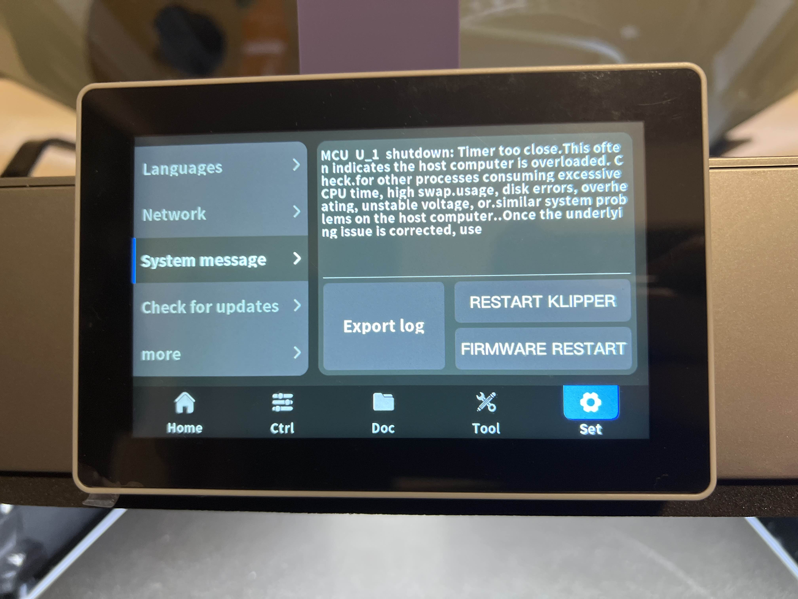

> [!IMPORTANT]
> The original version of this manual was implemented using the `init` system, which has since been replaced with `systemd`. This has now been resolved. Please remove the old method like this
> ```
> rm -f /etc/rc3.d/S99tuning
> rm -f /etc/init.d/tuning
> ```
> and re-download and apply the updated method if you installed a version prior to 8th Feb 2026.

> [!IMPORTANT]
> DO NOT EXECUTE THIS MANUAL WHILE YOU'RE PRINTING SOMETHING :)

# Qidi Plus4 System Tuning

If you've ever encountered the following error, or just want to make your Plus4 a little more responsive overall, this is the page for you.



## Introduction

The Qidi Plus4 utilises a RockChip based CPU with 4 cores running at a peak of 1.2Ghz

As such, there can be instances under certain high loads where the CPU can struggle to keep up with the MCU systems controlling the motion systems,
which leads to the occasional "MCU: Timer Too Close" (TCC in short) errors that causes Klipper to shut down.

There are a number of CPU intensive processes that can compete with Klipper for CPU resources

- `xindi` is Qidi's UI interface driving daemon that is responsible for converting clicks on the printer screen into Klipper actions, as well as driving USB storage, networking, and firmware updates
- `mjpg_streamer` is the video streaming encoding daemon that provides a video stream to monitor the current print
- `nginx` is the Web Server daemon that hosts the FluiddUI Web Interface service that slicers and a web browser can interact with
- `moonraker` is the API process that acts as an intermediary between Klipper and Web UI's such as Fluidd or Mainsail

Unfortunately the above processes can sometimes get in the way of Klipper, and cause CPU stuttering that is bad enough to cause TCC errors.

Additionally, the CPU is configured to run in an on-demand frequency-scaling mode that can also introduce stuttering as the Linux scheduler tries to dynamically adjust the CPU frequency to respond to high load scenarios.

Fortunately there are ways in which we can tune Qidi's system to better optimise the CPU power mode and resource usage.

# Installing a run-time system tuning script

I have developed a run-time service script that attempts to isolate non-Klipper essential services to an individual CPU core
as well as bind Klipper services the remaining 3 CPU cores.

Additionally, the CPU is placed into performance mode to prevent it from scaling its frequencies when idle.  This allows it
to respond more quickly to the load spikes that Klipper can introduce.

While ideally this installation procedure should be run when not printing anything, it is not a requirement.  It is generally safe
to install and run this script at any time.

## Installing and Activating the script itself

To install and activate the tuning, follow this sequence of steps:

1. ssh into your 3D Printer's Linux command shell (see [ssh-access](https://github.com/qidi-community/Plus4-Wiki/tree/main/content/ssh-access) for details)

2. Obtain a root shell on your printer like so:

```
sudo -i
```

3. Now run the following commands:

```
mkdir /opt/scripts
wget -O - https://raw.githubusercontent.com/qidi-community/Plus4-Wiki/refs/heads/main/content/system-tuning/qidiAffinityAndNice > /opt/scripts/qidiAffinityAndNice
chmod 755 /opt/scripts/qidiAffinityAndNice
/opt/scripts/qidiAffinityAndNice status
```

This downloads the tuning script and runs it once, so you can see the current situation. It's a wall of text, it's okay.

> [!NOTE]
> `mjpg_streamer` often creates transient short-lived threads, and so the script may occasionally complain that it cannot find one of the `mjpg_streamer` processes.  In the chance that this error is seen, then it can be safely ignored.

4. Now we need to add the script to the system startup sequence.

```
wget -O - https://raw.githubusercontent.com/qidi-community/Plus4-Wiki/refs/heads/main/content/system-tuning/qidisystemtuning.service > /etc/systemd/system/qidisystemtuning.service
wget -O - https://raw.githubusercontent.com/qidi-community/Plus4-Wiki/refs/heads/main/content/system-tuning/qidisystemtuning.timer > /etc/systemd/system/qidisystemtuning.timer
systemctl daemon-reexec ## This is potentially overkill, but just to be sure
systemctl enable --now qidisystemtuning.service
systemctl enable --now qidisystemtuning.timer
```
This will download 2 files, force a reload of `systemd` itself, and then tell it that both the service (applying nice and affinity) and timer (running this 60 seconds after boot) should be considered enabled. Then, you will manually initiate the timer, and as a result apply the nice and affinity rules after 30 seconds waiting.

Output of the last 2 commands should be that there were links created:

```
root@mkspi:/etc/systemd/system# systemctl enable qidisystemtuning.service
Created symlink /etc/systemd/system/graphical.target.wants/qidisystemtuning.service → /etc/systemd/system/qidisystemtuning.service.
root@mkspi:/etc/systemd/system# systemctl enable qidisystemtuning.timer
Created symlink /etc/systemd/system/timers.target.wants/qidisystemtuning.timer → /etc/systemd/system/qidisystemtuning.timer.
root@mkspi:/etc/systemd/system#
```

After waiting for 40 seconds, execute the command `/opt/scripts/qidiAffinityAndNice status`, to see the difference with the output in step 3.

5. Now exit out of the root shell like so with the following command:

```
exit
```

# Verifying systemd implementation

## The systemd service

Run the following command:

```
systemctl status qidisystemtuning.service
```
This will display the status of the systemd service, NOT the nice or affinity, as well as the last 10 lines of logs:

```
● qidisystemtuning.service - Qidi Xindi, Klipper, webcam process isolation and niceness
   Loaded: loaded (/etc/systemd/system/qidisystemtuning.service; enabled; vendor preset: enabled)
   Active: active (exited) since Sun 2026-02-08 09:43:05 UTC; 2h 31min ago
  Process: 5966 ExecReload=/etc/init.d/qidiAffinityAndNice reload (code=exited, status=0/SUCCESS)
 Main PID: 1560 (code=exited, status=0/SUCCESS)

Feb 08 12:14:26 mkspi qidiAffinityAndNice[5966]: 1551 (process ID) old priority 1, new priority 1
Feb 08 12:14:26 mkspi qidiAffinityAndNice[5966]: 1552 (process ID) old priority 1, new priority 1
Feb 08 12:14:26 mkspi qidiAffinityAndNice[5966]: 1553 (process ID) old priority 1, new priority 1
Feb 08 12:14:26 mkspi qidiAffinityAndNice[5966]: 1554 (process ID) old priority 1, new priority 1
Feb 08 12:14:26 mkspi qidiAffinityAndNice[5966]: 1557 (process ID) old priority 1, new priority 1
Feb 08 12:14:26 mkspi qidiAffinityAndNice[5966]: Setting all mjpg_streamer threads to niceness level 2
Feb 08 12:14:26 mkspi qidiAffinityAndNice[5966]: 1518 (process ID) old priority 2, new priority 2
Feb 08 12:14:26 mkspi qidiAffinityAndNice[5966]: 1542 (process ID) old priority 2, new priority 2
Feb 08 12:14:26 mkspi qidiAffinityAndNice[5966]: 1543 (process ID) old priority 2, new priority 2
Feb 08 12:14:26 mkspi systemd[1]: Reloaded Qidi Xindi, Klipper, webcam process isolation and niceness.
```

## The systemd timer

Run the following command:

```
systemctl list-timers | grep qidi
```
and you'll see when the timer was initiated
```
n/a                          n/a        Sun 2026-02-08 09:42:42 UTC  2h 36min ago qidisystemtuning.timer       qidisystemtuning.service
```
# Verifying CPU Performance Mode

Run the following command:

```
journalctl -u qidisystemtuning 
```

This should generate output similar to the following:

```
-- Logs begin at Sun 2026-02-08 09:17:07 UTC, end at Sun 2026-02-08 12:19:33 UTC. --
Feb 08 09:17:16 mkspi systemd[1]: Starting Qidi Xindi, Klipper, webcam process isolation and niceness...
Feb 08 09:43:04 mkspi qidiAffinityAndNice[1560]: Placing Printer CPU into Performance mode with fixed frequency
Feb 08 09:43:04 mkspi qidiAffinityAndNice[1560]: cpufrequtils 008: cpufreq-info (C) Dominik Brodowski 2004-2009
Feb 08 09:43:04 mkspi qidiAffinityAndNice[1560]: Report errors and bugs to cpufreq@vger.kernel.org, please.
Feb 08 09:43:04 mkspi qidiAffinityAndNice[1560]: analyzing CPU 0:
Feb 08 09:43:04 mkspi qidiAffinityAndNice[1560]:   driver: cpufreq-dt
Feb 08 09:43:04 mkspi qidiAffinityAndNice[1560]:   CPUs which run at the same hardware frequency: 0 1 2 3
Feb 08 09:43:04 mkspi qidiAffinityAndNice[1560]:   CPUs which need to have their frequency coordinated by software: 0 1 2 3
Feb 08 09:43:04 mkspi qidiAffinityAndNice[1560]:   maximum transition latency: 62.0 us.
Feb 08 09:43:04 mkspi qidiAffinityAndNice[1560]:   hardware limits: 408 MHz - 1.20 GHz
Feb 08 09:43:04 mkspi qidiAffinityAndNice[1560]:   available frequency steps: 408 MHz, 600 MHz, 816 MHz, 1.01 GHz, 1.20 GHz
Feb 08 09:43:04 mkspi qidiAffinityAndNice[1560]:   available cpufreq governors: conservative, ondemand, userspace, powersave, performance, schedutil
Feb 08 09:43:04 mkspi qidiAffinityAndNice[1560]:   current policy: frequency should be within 1.20 GHz and 1.20 GHz.
Feb 08 09:43:04 mkspi qidiAffinityAndNice[1560]:                   The governor "performance" may decide which speed to use
Feb 08 09:43:04 mkspi qidiAffinityAndNice[1560]:                   within this range.
Feb 08 09:43:04 mkspi qidiAffinityAndNice[1560]:   current CPU frequency is 1.20 GHz (asserted by call to hardware).
Feb 08 09:43:04 mkspi qidiAffinityAndNice[1560]:   cpufreq stats: 408 MHz:2.18%, 600 MHz:5.66%, 816 MHz:0.42%, 1.01 GHz:0.71%, 1.20 GHz:91.03%  (161)
```

The important lines here at the 3 lines starting at `current_policy:` (5th line from the bottom).

The above output is informing us that the CPU will choose a frequency between 1200MHz and 1200Mhz (ie. a constant 1200Mhz) and that the `performance` CPU frequency governor is active.

This verifies that the CPU on the Plus4 is now operating in its highest possible performance mode.

## Verifying Process Niceness

While in the same logs (you executed command `journalctl -u qidisystemtuning`, you can scroll in logs with arrow up and down, or Ctrl+F for page **F**orward and Ctrl+B for page **B**ack)

You should see that all `xindi` was affined to CPU 0, that `mjpg_streamer`, `moonraker`, and `nginx` processes and threads were affined to CPU 3, and all
`klippy` processes and threads were affined to CPU 1 and 2.

```
Feb 08 09:43:04 mkspi qidiAffinityAndNice[1560]: Setting CPU affinity for all /root/xindi/build/xindi threads to CPU 0
Feb 08 09:43:04 mkspi qidiAffinityAndNice[1560]: pid 1559's current affinity list: 0-3
Feb 08 09:43:04 mkspi qidiAffinityAndNice[1560]: pid 1559's new affinity list: 0
....
Feb 08 09:43:04 mkspi qidiAffinityAndNice[1560]: Setting CPU affinity for all klippy threads to CPU 1-2
Feb 08 09:43:04 mkspi qidiAffinityAndNice[1560]: pid 1495's current affinity list: 0-3
Feb 08 09:43:04 mkspi qidiAffinityAndNice[1560]: pid 1495's new affinity list: 1,2
....
Feb 08 09:43:04 mkspi qidiAffinityAndNice[1560]: Setting CPU affinity for all mjpg_streamer threads to CPU 3
Feb 08 09:43:04 mkspi qidiAffinityAndNice[1560]: pid 1518's current affinity list: 0-3
Feb 08 09:43:04 mkspi qidiAffinityAndNice[1560]: pid 1518's new affinity list: 3
....
Feb 08 09:43:04 mkspi qidiAffinityAndNice[1560]: Setting CPU affinity for all nginx threads to CPU 3
Feb 08 09:43:04 mkspi qidiAffinityAndNice[1560]: pid 1551's current affinity list: 0-3
Feb 08 09:43:04 mkspi qidiAffinityAndNice[1560]: pid 1551's new affinity list: 3
....
Feb 08 09:43:04 mkspi qidiAffinityAndNice[1560]: Setting CPU affinity for all moonraker threads to CPU 3
Feb 08 09:43:04 mkspi qidiAffinityAndNice[1560]: pid 1489's current affinity list: 0-3
Feb 08 09:43:04 mkspi qidiAffinityAndNice[1560]: pid 1489's new affinity list: 3
```


You will also see that the processes have gotten a new nice-ness, and that the script was completed:

```
Feb 08 09:43:04 mkspi qidiAffinityAndNice[1560]: Setting niceness of xindi, mjpg_streamer, nginx
Feb 08 09:43:04 mkspi qidiAffinityAndNice[1560]: Setting all /root/xindi/build/xindi threads to niceness level 1
Feb 08 09:43:05 mkspi qidiAffinityAndNice[1560]: 1559 (process ID) old priority 0, new priority 1
....
Feb 08 09:43:05 mkspi qidiAffinityAndNice[1560]: Setting all nginx threads to niceness level 1
Feb 08 09:43:05 mkspi qidiAffinityAndNice[1560]: 1551 (process ID) old priority 0, new priority 1
....
Feb 08 09:43:05 mkspi qidiAffinityAndNice[1560]: Setting all mjpg_streamer threads to niceness level 2
Feb 08 09:43:05 mkspi qidiAffinityAndNice[1560]: 1518 (process ID) old priority 0, new priority 2
....
Feb 08 09:43:05 mkspi systemd[1]: Started Qidi Xindi, Klipper, webcam process isolation and niceness.
```

### Verify niceness externally

To verify the Unix scheduling niceness changes run the `top` command and take note of the nice level for the `xindi`, `mjpg_streamer`,
and `nginx` processes (in the `NI` column). The values should be set to `1`, `2`, and `1` respectively.  The script does not adjust the niceness level of
either `klippy` or `moonraker` (ie. the `python` commands and line 2 and 3 of the screenshot) so their nice levels should remain at `0`.


Alternately, run the following command:

```
/opt/scripts/qidiAffinityAndNice status
```

and that will extract the Nice level of the processes, and should present output similar to the following:

```
Showing unique Process Niceness levels:
1 nginx:
1 /root/xindi/build/xindi
2 ./mjpg_streamer
```

where the number at the start represents the Nice level of the process. 

## What if I restart `mjpg_streamer` by changing values in `webcam.txt`?

In the event that you modify the `webcam.txt` parameters, this will intiate a new set of `mjpg_streamer` process/threads
and the tuning script will need to be manually re-run if you don't wish to power-cycle the printer.  This can be achieved
at any time with the following command:

```
sudo systemctl reload qidisystemtuning.service
```

which will re-apply the tuning to the currently running system

# Deactivating the tuning

If you wish to deactivate the system performance tuning, without uninstalling the script, run the following command:

```
sudo systemctl stop qidisystemtuning.service
```

This can be useful when making comparisons as to how the printer behaves with, and without, the tuning parameters active

# Uninstalling

In the event that the tuning script is causing any issues, it can be uninstalled via the following procedure:

Log into your printer via ssh and run the following command:

```
sudo systemctl disable --now qidisystemtuning.service
sudo systemctl disable --now qidisystemtuning.timer
sudo rm -f /opt/scripts/qidiAffinityAndNice /etc/systemd/system/qidisystemtuning*
sudo systemctl daemon-reload
```
