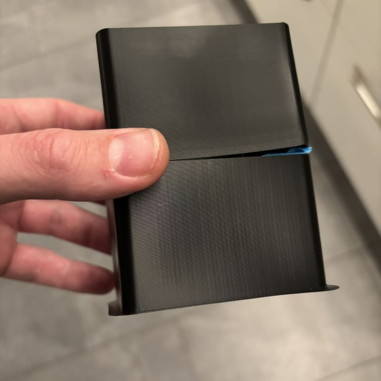

# Troubleshooting VFAs (vertical fine artifacts)

Before attempting anything in this guide, you should already have your printer setup and tuned. Input shaper must be active and tuned. 

VFAs are usually the last item to tune because all other issues must be ruled out first.

An excellent resource is [Ellis' guide](https://ellis3dp.com/Print-Tuning-Guide/articles/troubleshooting/vfas.html). Much of this article uses advice from his guide.

## VFAs or Resonance?

It's easy to confuse VFAs with resonance. Sometimes they happen at the same time which confuses the matter even more. 

VFAs will always be perfectly vertical. You can run a simple test by printing this test. 

Which one of these has VFAs?

(Answer: Both)

Both of these test prints are examples of VFAs. The spacing can vary, they can be faint sometimes, but they are always perfectly vertical.

## Possible solutions

If you confirm you do indeed have VFAs, there are several steps that can be taken to fix them.

### Check belts and pulleys 

Run your finger across all your belts and feel if there is any debris attached to them.

Check your idler pulleys are clean and spinning when the belts move. You want all of your pulleys to spin freely without resistance. 

### Tighten belts

Follow [this guide](https://wiki.qidi3d.com/en/Plus4/Maintenance/Adjustment-belt) for tightening the belts. 

If you think your belts are too loose, you can [print a mod](https://www.printables.com/model/1044712-qidi-plus4-belt-tensioners/comments/2134355) which should give you more control over the belt tension. 

### Lube idler pulleys

Follow [this video](https://drive.google.com/file/d/1_KHpMQJNxle0u21L5dIt-LYLbkvVnGiD/view) for how to lube your idler pulleys. 

Your idlers may spin just fine because they could be sticking a tiny bit or they are rubbing on the plastic housing. You can use oil (as demonstrated in th video) or PTFE based grease. 

### Check your X Carriage Screws

If you had the problem with a wobbly X Carriage due to the bearing being loose, check the screws are not too tight. If you do not have the loose bearing issue, do not use the screws. 

